# Technical Specifications

## 1. INTRODUCTION

### EXECUTIVE SUMMARY

The React Todo List application is a lightweight, user-friendly task management solution designed to help users organize and track their daily activities. This web-based application leverages React.js to deliver a responsive, intuitive interface for managing personal or professional tasks.

| Project Aspect | Description |
|----------------|-------------|
| Core Problem | Inefficient task tracking and management in daily activities |
| Key Stakeholders | End users, project managers, development team |
| Target Users | Individuals seeking simple task organization, teams requiring basic task coordination |
| Value Proposition | Increased productivity through organized task management, reduced cognitive load, and improved task completion rates |

### SYSTEM OVERVIEW

#### Project Context

| Context Element | Description |
|-----------------|-------------|
| Business Context | Positioned as an entry-level task management solution in the productivity tools market |
| Current Limitations | Replaces manual task tracking methods (paper lists, notes applications) |
| Enterprise Integration | Standalone application with potential for future integration with calendar and notification systems |

#### High-Level Description

The React Todo List application provides a streamlined approach to task management with the following capabilities:

- Task creation, editing, and deletion
- Task status tracking (complete/incomplete)
- Task prioritization
- Persistent storage of tasks
- Responsive design for multi-device usage

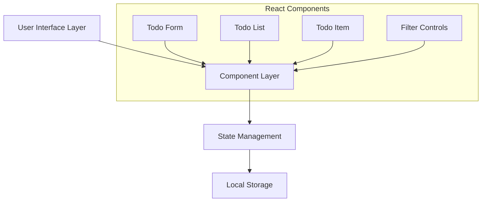
```mermaid
graph TD
    A[User Interface Layer] --> B[Component Layer]
    B --> C[State Management]
    C --> D[Local Storage]
    
    subgraph "React Components"
    B1[Todo Form] --> B
    B2[Todo List] --> B
    B3[Todo Item] --> B
    B4[Filter Controls] --> B
    end
```

#### Success Criteria

| Criteria Type | Description |
|---------------|-------------|
| Measurable Objectives | 1. User task creation time under 5 seconds<br>2. Task management interface loads in under 2 seconds<br>3. Data persistence across browser sessions |
| Critical Success Factors | 1. Intuitive user interface<br>2. Reliable task state management<br>3. Responsive design across devices |
| Key Performance Indicators | 1. User engagement metrics (time spent, return rate)<br>2. Task completion rate<br>3. User satisfaction score |

### SCOPE

#### In-Scope

**Core Features and Functionalities:**

| Feature Category | Included Capabilities |
|------------------|------------------------|
| Task Management | - Create new tasks<br>- Mark tasks as complete/incomplete<br>- Edit existing tasks<br>- Delete tasks<br>- Set task priorities |
| User Interface | - Responsive design<br>- Intuitive controls<br>- Visual task status indicators |
| Data Persistence | - Local storage integration<br>- Session persistence |
| Task Organization | - Filter by status (all/active/completed)<br>- Sort by priority |

**Implementation Boundaries:**

| Boundary Type | Coverage |
|---------------|----------|
| System Boundaries | Browser-based web application |
| User Groups | Individual users, small teams |
| Geographic Coverage | Global (language: English) |
| Data Domains | Task information, user preferences |

#### Out-of-Scope

- User authentication and multi-user support
- Cloud synchronization across devices
- Advanced task features (recurring tasks, subtasks, attachments)
- Calendar integration
- Mobile native applications (iOS/Android)
- Email or push notifications
- Team collaboration features
- Reporting and analytics
- API for third-party integrations
- Offline mode with synchronization

## 2. PRODUCT REQUIREMENTS

### 2.1 FEATURE CATALOG

#### 2.1.1 Task Management

| Feature Metadata | Details |
|------------------|---------|
| Unique ID | F-001 |
| Feature Name | Task Creation |
| Feature Category | Task Management |
| Priority Level | Critical |
| Status | Approved |

**Description:**
- **Overview:** Allows users to add new tasks to the todo list
- **Business Value:** Core functionality that enables the primary purpose of the application
- **User Benefits:** Quick and easy way to record tasks that need to be completed
- **Technical Context:** Requires form input handling and state management in React

**Dependencies:**
- **Prerequisite Features:** None
- **System Dependencies:** React state management
- **External Dependencies:** None
- **Integration Requirements:** Local storage for persistence

| Feature Metadata | Details |
|------------------|---------|
| Unique ID | F-002 |
| Feature Name | Task Completion Toggle |
| Feature Category | Task Management |
| Priority Level | Critical |
| Status | Approved |

**Description:**
- **Overview:** Allows users to mark tasks as complete or incomplete
- **Business Value:** Enables tracking of task progress
- **User Benefits:** Visual indication of completed work and remaining tasks
- **Technical Context:** Requires state updates and UI rendering changes

**Dependencies:**
- **Prerequisite Features:** Task Creation (F-001)
- **System Dependencies:** React state management
- **External Dependencies:** None
- **Integration Requirements:** Local storage for persistence

| Feature Metadata | Details |
|------------------|---------|
| Unique ID | F-003 |
| Feature Name | Task Deletion |
| Feature Category | Task Management |
| Priority Level | High |
| Status | Approved |

**Description:**
- **Overview:** Allows users to remove tasks from the list
- **Business Value:** Keeps the todo list relevant and uncluttered
- **User Benefits:** Ability to remove completed or irrelevant tasks
- **Technical Context:** Requires array manipulation in state management

**Dependencies:**
- **Prerequisite Features:** Task Creation (F-001)
- **System Dependencies:** React state management
- **External Dependencies:** None
- **Integration Requirements:** Local storage for persistence

| Feature Metadata | Details |
|------------------|---------|
| Unique ID | F-004 |
| Feature Name | Task Editing |
| Feature Category | Task Management |
| Priority Level | Medium |
| Status | Approved |

**Description:**
- **Overview:** Allows users to modify existing task descriptions
- **Business Value:** Increases accuracy of task information
- **User Benefits:** Ability to correct mistakes or update task details
- **Technical Context:** Requires form handling and state updates

**Dependencies:**
- **Prerequisite Features:** Task Creation (F-001)
- **System Dependencies:** React state management
- **External Dependencies:** None
- **Integration Requirements:** Local storage for persistence

#### 2.1.2 Task Organization

| Feature Metadata | Details |
|------------------|---------|
| Unique ID | F-005 |
| Feature Name | Task Filtering |
| Feature Category | Task Organization |
| Priority Level | Medium |
| Status | Approved |

**Description:**
- **Overview:** Allows users to filter tasks by completion status (all/active/completed)
- **Business Value:** Improves task management efficiency
- **User Benefits:** Focused view of relevant tasks based on current needs
- **Technical Context:** Requires filter logic and conditional rendering

**Dependencies:**
- **Prerequisite Features:** Task Creation (F-001), Task Completion Toggle (F-002)
- **System Dependencies:** React state management
- **External Dependencies:** None
- **Integration Requirements:** None

| Feature Metadata | Details |
|------------------|---------|
| Unique ID | F-006 |
| Feature Name | Task Prioritization |
| Feature Category | Task Organization |
| Priority Level | Medium |
| Status | Approved |

**Description:**
- **Overview:** Allows users to set and visualize task priorities
- **Business Value:** Enables focus on high-value activities
- **User Benefits:** Visual indication of task importance
- **Technical Context:** Requires additional task properties and UI indicators

**Dependencies:**
- **Prerequisite Features:** Task Creation (F-001)
- **System Dependencies:** React state management
- **External Dependencies:** None
- **Integration Requirements:** Local storage for persistence

#### 2.1.3 Data Persistence

| Feature Metadata | Details |
|------------------|---------|
| Unique ID | F-007 |
| Feature Name | Local Storage Integration |
| Feature Category | Data Persistence |
| Priority Level | High |
| Status | Approved |

**Description:**
- **Overview:** Saves todo list data to browser's local storage
- **Business Value:** Prevents data loss between sessions
- **User Benefits:** Tasks persist across page refreshes and browser restarts
- **Technical Context:** Requires browser localStorage API integration

**Dependencies:**
- **Prerequisite Features:** Task Creation (F-001)
- **System Dependencies:** Browser localStorage API
- **External Dependencies:** None
- **Integration Requirements:** None

### 2.2 FUNCTIONAL REQUIREMENTS TABLE

#### 2.2.1 Task Management Requirements

| Requirement Details | Specifications |
|---------------------|----------------|
| Requirement ID | F-001-RQ-001 |
| Description | Users must be able to add new tasks to the todo list |
| Acceptance Criteria | 1. Input field for task description<br>2. Submit button or enter key functionality<br>3. New task appears in the list immediately<br>4. Empty tasks cannot be added |
| Priority | Must-Have |
| Complexity | Low |

**Technical Specifications:**
- **Input Parameters:** Task description (text)
- **Output/Response:** Updated todo list with new task
- **Performance Criteria:** Task addition completes in under 500ms
- **Data Requirements:** Task object with unique ID, description, and completion status

**Validation Rules:**
- **Business Rules:** Task description cannot be empty
- **Data Validation:** Trim whitespace from task description
- **Security Requirements:** Sanitize input to prevent XSS
- **Compliance Requirements:** None

| Requirement Details | Specifications |
|---------------------|----------------|
| Requirement ID | F-002-RQ-001 |
| Description | Users must be able to mark tasks as complete or incomplete |
| Acceptance Criteria | 1. Checkbox or toggle control for each task<br>2. Visual indication of task completion status<br>3. Status change persists after page refresh |
| Priority | Must-Have |
| Complexity | Low |

**Technical Specifications:**
- **Input Parameters:** Task ID, completion status (boolean)
- **Output/Response:** Updated task with new completion status
- **Performance Criteria:** Status change reflects immediately
- **Data Requirements:** Task object with completion status property

**Validation Rules:**
- **Business Rules:** None
- **Data Validation:** None
- **Security Requirements:** None
- **Compliance Requirements:** None

| Requirement Details | Specifications |
|---------------------|----------------|
| Requirement ID | F-003-RQ-001 |
| Description | Users must be able to delete tasks from the list |
| Acceptance Criteria | 1. Delete button/icon for each task<br>2. Confirmation prompt before deletion (optional)<br>3. Task removed immediately after confirmation<br>4. Deletion persists after page refresh |
| Priority | Must-Have |
| Complexity | Low |

**Technical Specifications:**
- **Input Parameters:** Task ID
- **Output/Response:** Updated todo list without deleted task
- **Performance Criteria:** Deletion completes in under 500ms
- **Data Requirements:** Task ID for identification

**Validation Rules:**
- **Business Rules:** None
- **Data Validation:** Verify task exists before deletion
- **Security Requirements:** None
- **Compliance Requirements:** None

| Requirement Details | Specifications |
|---------------------|----------------|
| Requirement ID | F-004-RQ-001 |
| Description | Users must be able to edit existing task descriptions |
| Acceptance Criteria | 1. Edit button/icon for each task<br>2. Input field pre-populated with current description<br>3. Save and cancel options<br>4. Changes persist after page refresh |
| Priority | Should-Have |
| Complexity | Medium |

**Technical Specifications:**
- **Input Parameters:** Task ID, updated description (text)
- **Output/Response:** Updated task with new description
- **Performance Criteria:** Edit operation completes in under 500ms
- **Data Requirements:** Task ID and updated description

**Validation Rules:**
- **Business Rules:** Updated description cannot be empty
- **Data Validation:** Trim whitespace from updated description
- **Security Requirements:** Sanitize input to prevent XSS
- **Compliance Requirements:** None

#### 2.2.2 Task Organization Requirements

| Requirement Details | Specifications |
|---------------------|----------------|
| Requirement ID | F-005-RQ-001 |
| Description | Users must be able to filter tasks by completion status |
| Acceptance Criteria | 1. Filter controls (All/Active/Completed)<br>2. List updates immediately when filter changes<br>3. Filter state persists after page refresh |
| Priority | Should-Have |
| Complexity | Low |

**Technical Specifications:**
- **Input Parameters:** Filter type (string: "all", "active", "completed")
- **Output/Response:** Filtered list of tasks
- **Performance Criteria:** Filter applies in under 300ms
- **Data Requirements:** Task completion status

**Validation Rules:**
- **Business Rules:** None
- **Data Validation:** Filter value must be one of the predefined options
- **Security Requirements:** None
- **Compliance Requirements:** None

| Requirement Details | Specifications |
|---------------------|----------------|
| Requirement ID | F-006-RQ-001 |
| Description | Users must be able to set priority levels for tasks |
| Acceptance Criteria | 1. Priority selector for each task<br>2. Visual indication of priority level<br>3. Priority changes persist after page refresh |
| Priority | Could-Have |
| Complexity | Medium |

**Technical Specifications:**
- **Input Parameters:** Task ID, priority level (enum: high, medium, low)
- **Output/Response:** Updated task with new priority
- **Performance Criteria:** Priority change reflects immediately
- **Data Requirements:** Task object with priority property

**Validation Rules:**
- **Business Rules:** Priority must be one of the predefined levels
- **Data Validation:** Validate priority value
- **Security Requirements:** None
- **Compliance Requirements:** None

#### 2.2.3 Data Persistence Requirements

| Requirement Details | Specifications |
|---------------------|----------------|
| Requirement ID | F-007-RQ-001 |
| Description | Application must save todo list data to browser's local storage |
| Acceptance Criteria | 1. Tasks persist after page refresh<br>2. Tasks persist after browser restart<br>3. All task properties (description, completion status, priority) are preserved |
| Priority | Should-Have |
| Complexity | Medium |

**Technical Specifications:**
- **Input Parameters:** Todo list data (array of task objects)
- **Output/Response:** Confirmation of successful storage
- **Performance Criteria:** Storage operation completes in under 200ms
- **Data Requirements:** Serializable task objects

**Validation Rules:**
- **Business Rules:** None
- **Data Validation:** Validate data structure before storage
- **Security Requirements:** No sensitive data in local storage
- **Compliance Requirements:** None

### 2.3 FEATURE RELATIONSHIPS

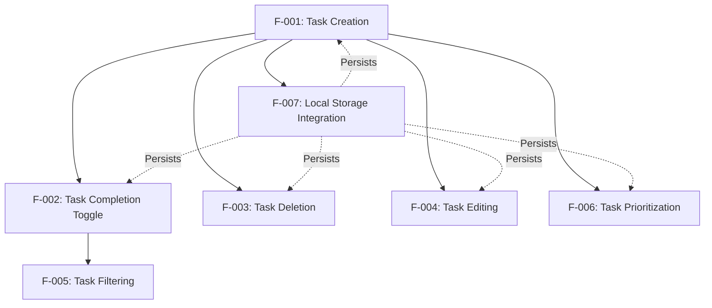
```mermaid
graph TD
    F001[F-001: Task Creation] --> F002[F-002: Task Completion Toggle]
    F001 --> F003[F-003: Task Deletion]
    F001 --> F004[F-004: Task Editing]
    F001 --> F006[F-006: Task Prioritization]
    F001 --> F007[F-007: Local Storage Integration]
    F002 --> F005[F-005: Task Filtering]
    F007 -.-> |Persists| F001
    F007 -.-> |Persists| F002
    F007 -.-> |Persists| F003
    F007 -.-> |Persists| F004
    F007 -.-> |Persists| F006
```

**Integration Points:**
- Task Management features (F-001, F-002, F-003, F-004) integrate with Local Storage (F-007)
- Task Filtering (F-005) depends on Task Completion Toggle (F-002)

**Shared Components:**
- Task Item component used across multiple features
- Form components for task creation and editing
- Filter controls component

**Common Services:**
- Task state management service
- Local storage service

### 2.4 IMPLEMENTATION CONSIDERATIONS

#### 2.4.1 Task Creation (F-001)

- **Technical Constraints:** Form submission handling in React
- **Performance Requirements:** Immediate UI update after task creation
- **Scalability Considerations:** Support for large numbers of tasks
- **Security Implications:** Input sanitization to prevent XSS
- **Maintenance Requirements:** Clear separation of UI and state logic

#### 2.4.2 Task Completion Toggle (F-002)

- **Technical Constraints:** State update optimization
- **Performance Requirements:** Immediate visual feedback
- **Scalability Considerations:** Efficient rendering for large lists
- **Security Implications:** None
- **Maintenance Requirements:** Clear state transition logic

#### 2.4.3 Task Deletion (F-003)

- **Technical Constraints:** Array manipulation in state
- **Performance Requirements:** Immediate removal from UI
- **Scalability Considerations:** Efficient array operations
- **Security Implications:** Validation of deletion requests
- **Maintenance Requirements:** Clean removal of all task references

#### 2.4.4 Task Editing (F-004)

- **Technical Constraints:** Form state management
- **Performance Requirements:** Smooth transition to/from edit mode
- **Scalability Considerations:** Edit mode for single task at a time
- **Security Implications:** Input sanitization
- **Maintenance Requirements:** Clear edit state management

#### 2.4.5 Task Filtering (F-005)

- **Technical Constraints:** Filter logic implementation
- **Performance Requirements:** Fast filtering for large lists
- **Scalability Considerations:** Efficient filtering algorithms
- **Security Implications:** None
- **Maintenance Requirements:** Clear filter state management

#### 2.4.6 Task Prioritization (F-006)

- **Technical Constraints:** Priority representation in UI
- **Performance Requirements:** Immediate visual feedback
- **Scalability Considerations:** Support for multiple priority levels
- **Security Implications:** None
- **Maintenance Requirements:** Consistent priority visualization

#### 2.4.7 Local Storage Integration (F-007)

- **Technical Constraints:** Browser storage limits
- **Performance Requirements:** Minimal impact on application performance
- **Scalability Considerations:** Efficient serialization for large datasets
- **Security Implications:** No sensitive data storage
- **Maintenance Requirements:** Error handling for storage failures

## 3. TECHNOLOGY STACK

### 3.1 PROGRAMMING LANGUAGES

| Language | Version | Purpose | Justification |
|----------|---------|---------|---------------|
| JavaScript | ES6+ | Frontend development | Industry standard for web development with broad browser support |
| HTML5 | 5 | Document structure | Required for web application structure |
| CSS3 | 3 | Styling | Required for application styling and responsive design |
| JSX | - | React component syntax | Enables declarative UI development within React |

### 3.2 FRAMEWORKS & LIBRARIES

| Framework/Library | Version | Purpose | Justification |
|-------------------|---------|---------|---------------|
| React | 18.x | UI component library | Provides efficient rendering through virtual DOM, component-based architecture ideal for modular todo list features |
| React DOM | 18.x | DOM manipulation | Required companion to React for browser rendering |
| PropTypes | 15.x | Runtime type checking | Enhances code quality and developer experience through prop validation |
| Classnames | 2.x | CSS class management | Simplifies conditional class application for task status visualization |

### 3.3 DATABASES & STORAGE

| Storage Solution | Version | Purpose | Justification |
|------------------|---------|---------|---------------|
| Browser LocalStorage | Web Storage API | Client-side data persistence | Meets requirement F-007 for task persistence between sessions without backend dependency |

**Storage Strategy:**
- Tasks stored as JSON string in browser's localStorage
- Data loaded on application initialization
- Data saved on every state change
- Storage key: `react-todo-list-data`

### 3.4 DEVELOPMENT & DEPLOYMENT

| Tool | Version | Purpose | Justification |
|------|---------|---------|---------------|
| Create React App | 5.x | Project scaffolding and build system | Provides standardized build configuration and development environment |
| npm | 8.x+ | Package management | Industry standard for JavaScript dependency management |
| ESLint | 8.x | Code quality | Enforces coding standards and catches potential issues |
| Jest | 29.x | Unit testing | React-compatible testing framework for component testing |
| React Testing Library | 13.x | Component testing | Encourages testing from user perspective |
| GitHub Pages | - | Static site hosting | Simple deployment option for client-side only applications |

**Development Workflow:**
- Local development using Create React App's development server
- Component-driven development approach
- Unit tests for core functionality
- Build process for production optimization

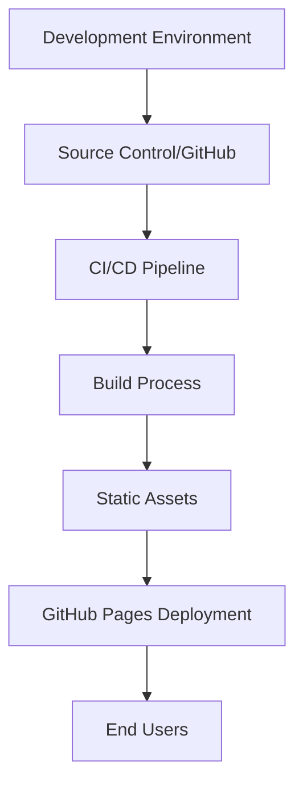
```mermaid
graph TD
    A[Development Environment] --> B[Source Control/GitHub]
    B --> C[CI/CD Pipeline]
    C --> D[Build Process]
    D --> E[Static Assets]
    E --> F[GitHub Pages Deployment]
    F --> G[End Users]
```

### 3.5 ARCHITECTURE PATTERNS

| Pattern | Implementation | Justification |
|---------|----------------|---------------|
| Component-Based Architecture | React components | Enables modular development of UI elements |
| Unidirectional Data Flow | React state management | Simplifies state tracking and updates |
| Container/Presentational Pattern | Smart/dumb components | Separates logic from presentation |
| Hooks Pattern | React hooks | Enables stateful logic in functional components |

**State Management Approach:**
- React's built-in useState and useEffect hooks
- Custom hooks for localStorage integration
- Context API for global state if needed
- No external state management library required due to application simplicity

## 4. PROCESS FLOWCHART

### 4.1 SYSTEM WORKFLOWS

#### 4.1.1 Core Business Processes

**Task Management Workflow**


```mermaid
flowchart TD
    Start([User Accesses Application]) --> LoadData[Load Tasks from LocalStorage]
    LoadData --> DisplayTasks[Display Todo List]
    
    DisplayTasks --> UserAction{User Action}
    
    UserAction -->|Add Task| AddTaskFlow
    UserAction -->|Toggle Completion| ToggleFlow
    UserAction -->|Edit Task| EditFlow
    UserAction -->|Delete Task| DeleteFlow
    UserAction -->|Filter Tasks| FilterFlow
    UserAction -->|Set Priority| PriorityFlow
    
    subgraph AddTaskFlow[Task Creation Flow]
        A1[User Enters Task Description] --> A2{Valid Input?}
        A2 -->|No| A3[Show Validation Error]
        A3 --> A1
        A2 -->|Yes| A4[Create Task Object]
        A4 --> A5[Add to Task List]
        A5 --> A6[Update UI]
        A6 --> A7[Save to LocalStorage]
    end
    
    subgraph ToggleFlow[Task Completion Flow]
        T1[User Clicks Checkbox] --> T2[Toggle Completion Status]
        T2 --> T3[Update Task in List]
        T3 --> T4[Update UI]
        T4 --> T5[Save to LocalStorage]
    end
    
    subgraph EditFlow[Task Editing Flow]
        E1[User Clicks Edit Button] --> E2[Display Edit Form]
        E2 --> E3[User Modifies Description]
        E3 --> E4{Valid Input?}
        E4 -->|No| E5[Show Validation Error]
        E5 --> E3
        E4 -->|Yes| E6[Update Task in List]
        E6 --> E7[Update UI]
        E7 --> E8[Save to LocalStorage]
    end
    
    subgraph DeleteFlow[Task Deletion Flow]
        D1[User Clicks Delete Button] --> D2{Confirm Deletion?}
        D2 -->|No| D3[Cancel Operation]
        D2 -->|Yes| D4[Remove Task from List]
        D4 --> D5[Update UI]
        D5 --> D6[Save to LocalStorage]
    end
    
    subgraph FilterFlow[Task Filtering Flow]
        F1[User Selects Filter Option] --> F2[Apply Filter Criteria]
        F2 --> F3[Update Displayed Tasks]
        F3 --> F4[Save Filter Preference]
    end
    
    subgraph PriorityFlow[Task Prioritization Flow]
        P1[User Selects Priority Level] --> P2[Update Task Priority]
        P2 --> P3[Update UI with Priority Indicator]
        P3 --> P4[Save to LocalStorage]
    end
    
    AddTaskFlow & ToggleFlow & EditFlow & DeleteFlow & FilterFlow & PriorityFlow --> DisplayTasks
```

**End-to-End User Journey**

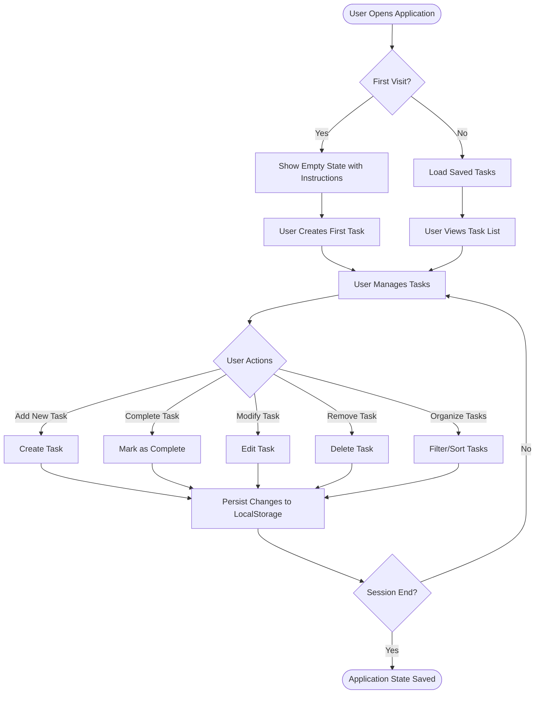
```mermaid
flowchart TD
    Start([User Opens Application]) --> FirstVisit{First Visit?}
    
    FirstVisit -->|Yes| EmptyState[Show Empty State with Instructions]
    FirstVisit -->|No| LoadSaved[Load Saved Tasks]
    
    EmptyState --> CreateFirst[User Creates First Task]
    LoadSaved --> ViewTasks[User Views Task List]
    
    CreateFirst --> ManageTasks[User Manages Tasks]
    ViewTasks --> ManageTasks
    
    ManageTasks --> Actions{User Actions}
    
    Actions -->|Add New Task| AddTask[Create Task]
    Actions -->|Complete Task| CompleteTask[Mark as Complete]
    Actions -->|Modify Task| EditTask[Edit Task]
    Actions -->|Remove Task| DeleteTask[Delete Task]
    Actions -->|Organize Tasks| FilterTasks[Filter/Sort Tasks]
    
    AddTask & CompleteTask & EditTask & DeleteTask & FilterTasks --> DataPersist[Persist Changes to LocalStorage]
    
    DataPersist --> SessionEnd{Session End?}
    SessionEnd -->|No| ManageTasks
    SessionEnd -->|Yes| End([Application State Saved])
```

#### 4.1.2 Integration Workflows

**LocalStorage Integration Flow**

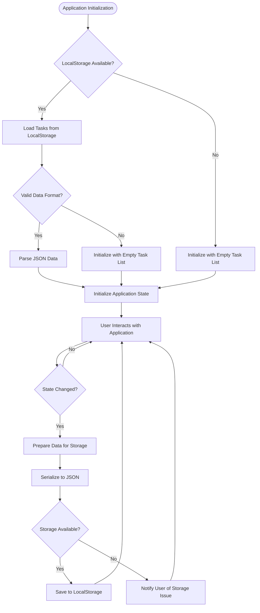
```mermaid
flowchart TD
    Start([Application Initialization]) --> CheckStorage{LocalStorage Available?}
    
    CheckStorage -->|Yes| LoadData[Load Tasks from LocalStorage]
    CheckStorage -->|No| FallbackMode[Initialize with Empty Task List]
    
    LoadData --> ValidateData{Valid Data Format?}
    ValidateData -->|Yes| ParseData[Parse JSON Data]
    ValidateData -->|No| ResetData[Initialize with Empty Task List]
    
    ParseData & ResetData & FallbackMode --> InitializeApp[Initialize Application State]
    
    InitializeApp --> UserInteraction[User Interacts with Application]
    
    UserInteraction --> StateChange{State Changed?}
    StateChange -->|No| UserInteraction
    StateChange -->|Yes| PrepareData[Prepare Data for Storage]
    
    PrepareData --> SerializeData[Serialize to JSON]
    SerializeData --> StorageAttempt{Storage Available?}
    
    StorageAttempt -->|Yes| SaveData[Save to LocalStorage]
    StorageAttempt -->|No| NotifyUser[Notify User of Storage Issue]
    
    SaveData & NotifyUser --> UserInteraction
```

### 4.2 FLOWCHART REQUIREMENTS

#### 4.2.1 Task Creation Process

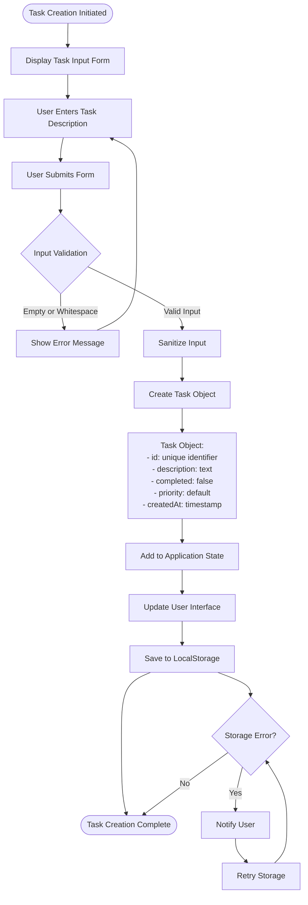
```mermaid
flowchart TD
    Start([Task Creation Initiated]) --> InputForm[Display Task Input Form]
    
    InputForm --> UserInput[User Enters Task Description]
    UserInput --> SubmitAction[User Submits Form]
    
    SubmitAction --> Validation{Input Validation}
    
    Validation -->|Empty or Whitespace| ValidationError[Show Error Message]
    ValidationError --> UserInput
    
    Validation -->|Valid Input| SanitizeInput[Sanitize Input]
    SanitizeInput --> CreateTaskObject[Create Task Object]
    
    CreateTaskObject --> TaskObject[
        Task Object:
        - id: unique identifier
        - description: text
        - completed: false
        - priority: default
        - createdAt: timestamp
    ]
    
    TaskObject --> AddToState[Add to Application State]
    AddToState --> UpdateUI[Update User Interface]
    UpdateUI --> PersistData[Save to LocalStorage]
    
    PersistData --> End([Task Creation Complete])
    
    %% Error handling path
    PersistData --> StorageError{Storage Error?}
    StorageError -->|Yes| NotifyStorageIssue[Notify User]
    NotifyStorageIssue --> RetryStorage[Retry Storage]
    RetryStorage --> StorageError
    StorageError -->|No| End
```

#### 4.2.2 Task Completion Toggle Process

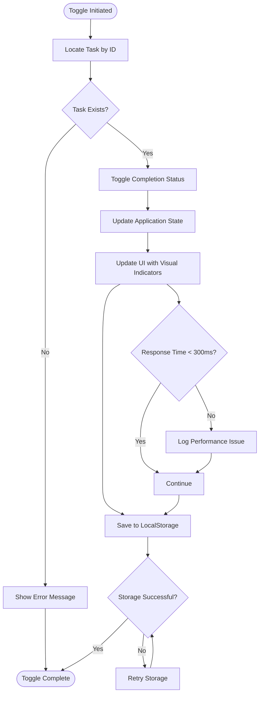
```mermaid
flowchart TD
    Start([Toggle Initiated]) --> FindTask[Locate Task by ID]
    
    FindTask --> TaskExists{Task Exists?}
    
    TaskExists -->|No| ErrorState[Show Error Message]
    ErrorState --> End([Process Terminated])
    
    TaskExists -->|Yes| UpdateStatus[Toggle Completion Status]
    UpdateStatus --> UpdateState[Update Application State]
    
    UpdateState --> UpdateUI[Update UI with Visual Indicators]
    UpdateUI --> PersistData[Save to LocalStorage]
    
    PersistData --> StorageSuccess{Storage Successful?}
    StorageSuccess -->|No| RetryStorage[Retry Storage]
    RetryStorage --> StorageSuccess
    
    StorageSuccess -->|Yes| End([Toggle Complete])
    
    %% SLA considerations
    UpdateUI --> PerformanceCheck{Response Time < 300ms?}
    PerformanceCheck -->|No| LogPerformanceIssue[Log Performance Issue]
    PerformanceCheck -->|Yes| ContinueFlow[Continue]
    LogPerformanceIssue --> ContinueFlow
    ContinueFlow --> PersistData
```

#### 4.2.3 Task Filtering Process

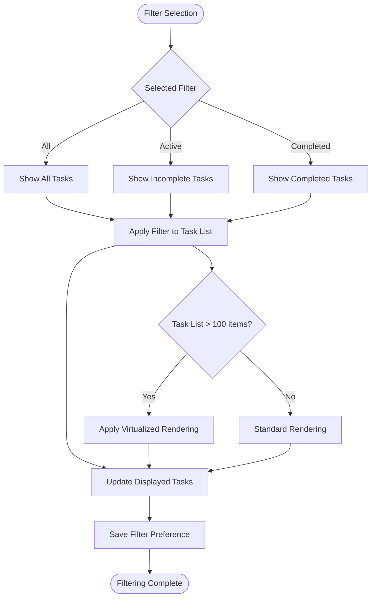
```mermaid
flowchart TD
    Start([Filter Selection]) --> FilterOption{Selected Filter}
    
    FilterOption -->|All| NoFilter[Show All Tasks]
    FilterOption -->|Active| ActiveFilter[Show Incomplete Tasks]
    FilterOption -->|Completed| CompletedFilter[Show Completed Tasks]
    
    NoFilter & ActiveFilter & CompletedFilter --> ApplyFilter[Apply Filter to Task List]
    
    ApplyFilter --> UpdateUI[Update Displayed Tasks]
    UpdateUI --> SavePreference[Save Filter Preference]
    
    SavePreference --> End([Filtering Complete])
    
    %% Performance considerations
    ApplyFilter --> LargeList{Task List > 100 items?}
    LargeList -->|Yes| OptimizeRendering[Apply Virtualized Rendering]
    LargeList -->|No| StandardRendering[Standard Rendering]
    OptimizeRendering & StandardRendering --> UpdateUI
```

### 4.3 TECHNICAL IMPLEMENTATION

#### 4.3.1 State Management Flow

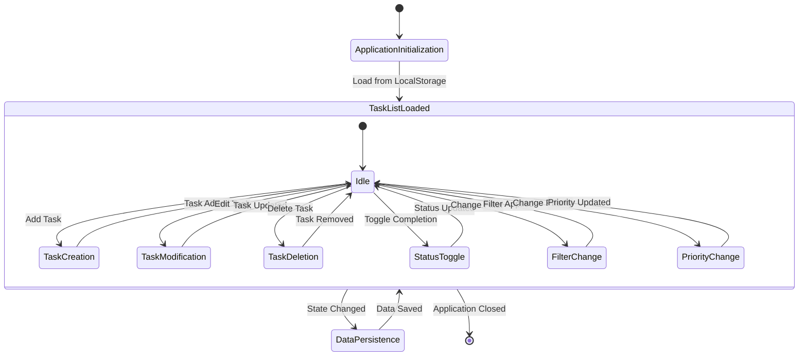
```mermaid
stateDiagram-v2
    [*] --> ApplicationInitialization
    
    ApplicationInitialization --> TaskListLoaded: Load from LocalStorage
    
    state TaskListLoaded {
        [*] --> Idle
        
        Idle --> TaskCreation: Add Task
        TaskCreation --> Idle: Task Added
        
        Idle --> TaskModification: Edit Task
        TaskModification --> Idle: Task Updated
        
        Idle --> TaskDeletion: Delete Task
        TaskDeletion --> Idle: Task Removed
        
        Idle --> StatusToggle: Toggle Completion
        StatusToggle --> Idle: Status Updated
        
        Idle --> FilterChange: Change Filter
        FilterChange --> Idle: Filter Applied
        
        Idle --> PriorityChange: Change Priority
        PriorityChange --> Idle: Priority Updated
    }
    
    TaskListLoaded --> DataPersistence: State Changed
    DataPersistence --> TaskListLoaded: Data Saved
    
    TaskListLoaded --> [*]: Application Closed
```

#### 4.3.2 Error Handling Flow

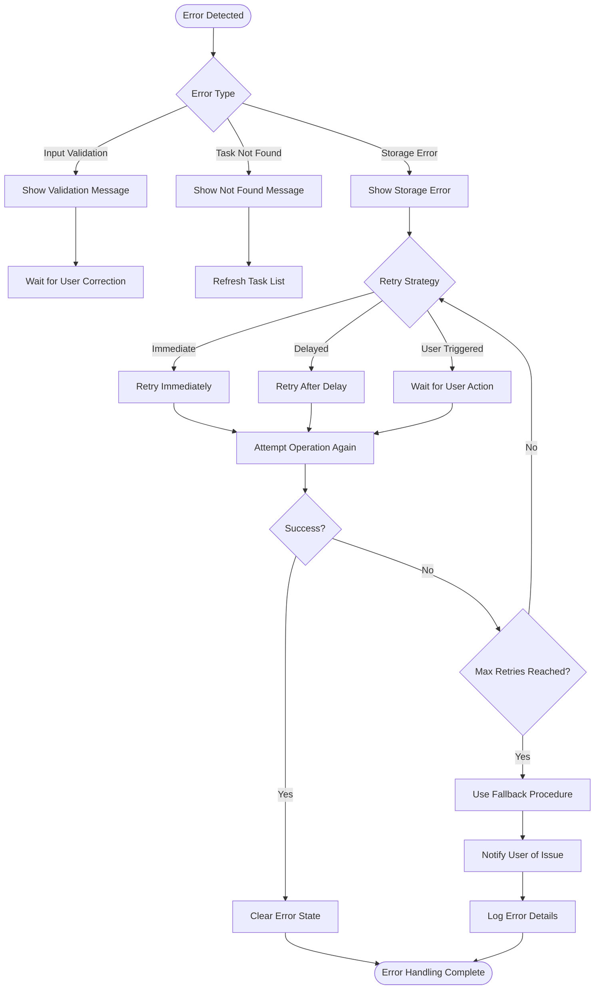
```mermaid
flowchart TD
    Start([Error Detected]) --> ErrorType{Error Type}
    
    ErrorType -->|Input Validation| ValidationError[Show Validation Message]
    ValidationError --> UserCorrection[Wait for User Correction]
    
    ErrorType -->|Task Not Found| NotFoundError[Show Not Found Message]
    NotFoundError --> RefreshList[Refresh Task List]
    
    ErrorType -->|Storage Error| StorageError[Show Storage Error]
    StorageError --> RetryStrategy{Retry Strategy}
    
    RetryStrategy -->|Immediate| ImmediateRetry[Retry Immediately]
    RetryStrategy -->|Delayed| DelayedRetry[Retry After Delay]
    RetryStrategy -->|User Triggered| ManualRetry[Wait for User Action]
    
    ImmediateRetry & DelayedRetry & ManualRetry --> RetryAttempt[Attempt Operation Again]
    
    RetryAttempt --> RetrySuccess{Success?}
    RetrySuccess -->|Yes| ClearError[Clear Error State]
    RetrySuccess -->|No| MaxRetries{Max Retries Reached?}
    
    MaxRetries -->|No| RetryStrategy
    MaxRetries -->|Yes| FallbackProcedure[Use Fallback Procedure]
    
    FallbackProcedure --> NotifyUser[Notify User of Issue]
    NotifyUser --> LogError[Log Error Details]
    
    ClearError & LogError --> End([Error Handling Complete])
```

### 4.4 REQUIRED DIAGRAMS

#### 4.4.1 High-Level System Workflow

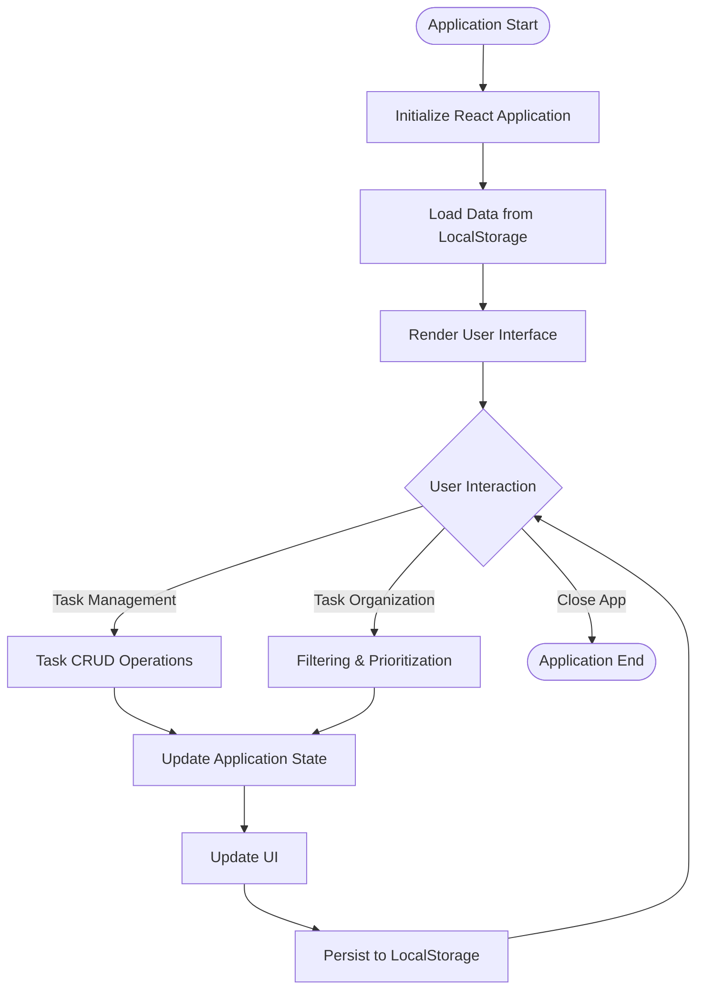
```mermaid
flowchart TD
    Start([Application Start]) --> Initialize[Initialize React Application]
    Initialize --> LoadData[Load Data from LocalStorage]
    LoadData --> RenderUI[Render User Interface]
    
    RenderUI --> UserInteraction{User Interaction}
    
    UserInteraction -->|Task Management| TaskManagement[Task CRUD Operations]
    UserInteraction -->|Task Organization| TaskOrganization[Filtering & Prioritization]
    
    TaskManagement --> StateUpdate[Update Application State]
    TaskOrganization --> StateUpdate
    
    StateUpdate --> RenderUpdate[Update UI]
    RenderUpdate --> PersistData[Persist to LocalStorage]
    
    PersistData --> UserInteraction
    
    UserInteraction -->|Close App| End([Application End])
```

#### 4.4.2 Integration Sequence Diagram

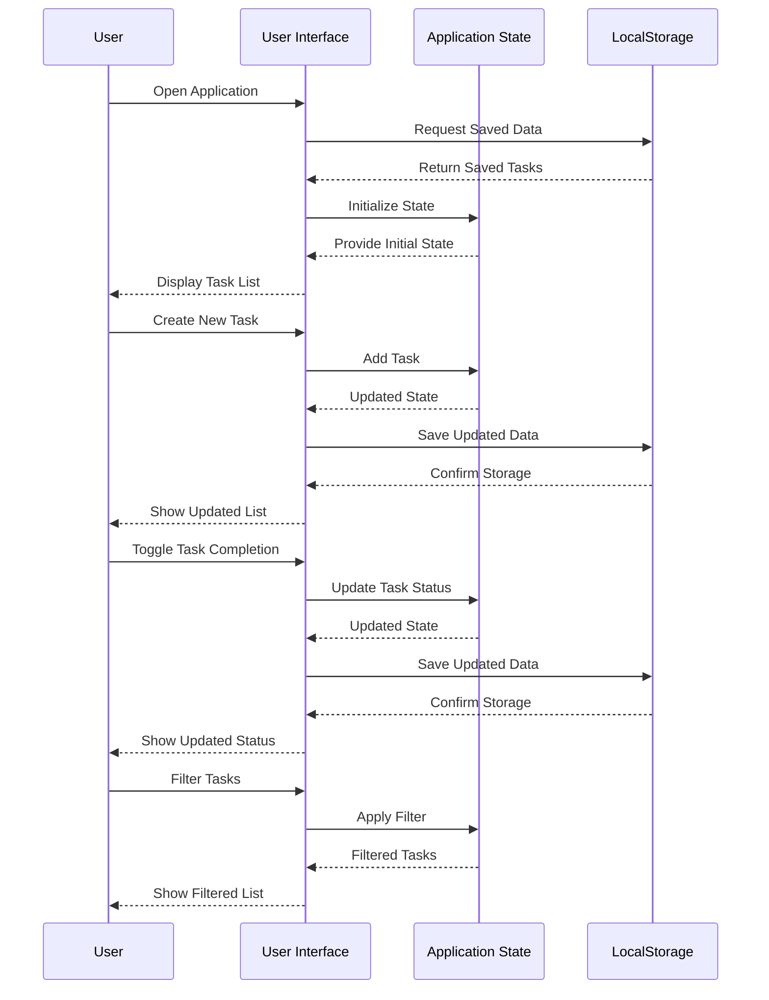
```mermaid
sequenceDiagram
    participant User
    participant UI as User Interface
    participant State as Application State
    participant Storage as LocalStorage
    
    User->>UI: Open Application
    UI->>Storage: Request Saved Data
    Storage-->>UI: Return Saved Tasks
    UI->>State: Initialize State
    State-->>UI: Provide Initial State
    UI-->>User: Display Task List
    
    User->>UI: Create New Task
    UI->>State: Add Task
    State-->>UI: Updated State
    UI->>Storage: Save Updated Data
    Storage-->>UI: Confirm Storage
    UI-->>User: Show Updated List
    
    User->>UI: Toggle Task Completion
    UI->>State: Update Task Status
    State-->>UI: Updated State
    UI->>Storage: Save Updated Data
    Storage-->>UI: Confirm Storage
    UI-->>User: Show Updated Status
    
    User->>UI: Filter Tasks
    UI->>State: Apply Filter
    State-->>UI: Filtered Tasks
    UI-->>User: Show Filtered List
```

#### 4.4.3 Error Handling Flowchart

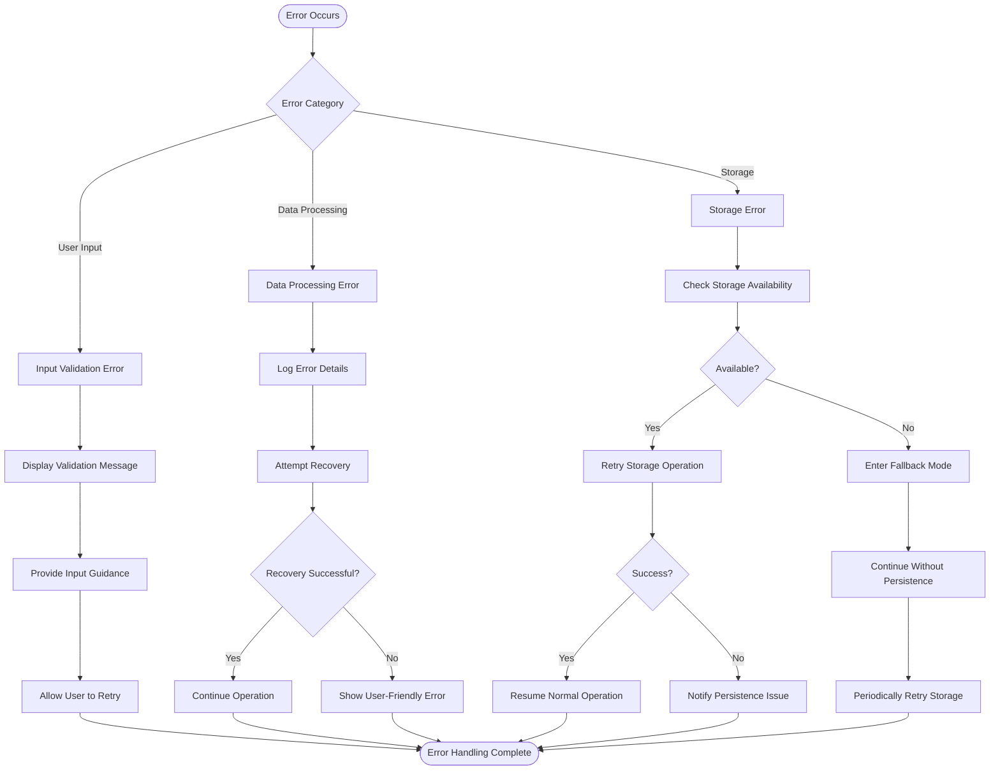
```mermaid
flowchart TD
    Start([Error Occurs]) --> ErrorCategory{Error Category}
    
    ErrorCategory -->|User Input| InputError[Input Validation Error]
    ErrorCategory -->|Data Processing| DataError[Data Processing Error]
    ErrorCategory -->|Storage| StorageError[Storage Error]
    
    InputError --> ShowValidationMessage[Display Validation Message]
    ShowValidationMessage --> ProvideGuidance[Provide Input Guidance]
    ProvideGuidance --> AllowRetry[Allow User to Retry]
    
    DataError --> LogDataError[Log Error Details]
    LogDataError --> AttemptRecovery[Attempt Recovery]
    AttemptRecovery --> RecoverySuccess{Recovery Successful?}
    RecoverySuccess -->|Yes| ContinueOperation[Continue Operation]
    RecoverySuccess -->|No| ShowErrorMessage[Show User-Friendly Error]
    
    StorageError --> CheckStorageAvailability[Check Storage Availability]
    CheckStorageAvailability --> AvailabilityStatus{Available?}
    AvailabilityStatus -->|Yes| RetryStorage[Retry Storage Operation]
    AvailabilityStatus -->|No| FallbackMode[Enter Fallback Mode]
    
    RetryStorage --> RetrySuccess{Success?}
    RetrySuccess -->|Yes| ResumeOperation[Resume Normal Operation]
    RetrySuccess -->|No| NotifyPersistenceIssue[Notify Persistence Issue]
    
    FallbackMode --> OperateWithoutPersistence[Continue Without Persistence]
    OperateWithoutPersistence --> PeriodicRetry[Periodically Retry Storage]
    
    AllowRetry & ContinueOperation & ShowErrorMessage & ResumeOperation & NotifyPersistenceIssue & PeriodicRetry --> End([Error Handling Complete])
```

#### 4.4.4 State Transition Diagram

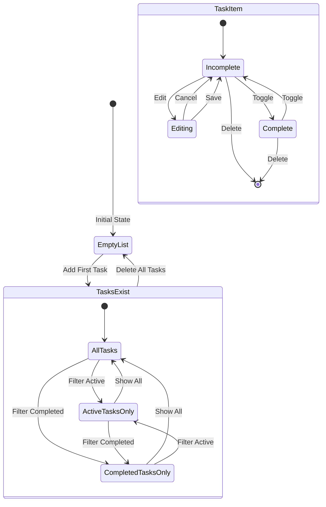
```mermaid
stateDiagram-v2
    [*] --> EmptyList: Initial State
    
    EmptyList --> TasksExist: Add First Task
    
    state TasksExist {
        [*] --> AllTasks
        
        AllTasks --> ActiveTasksOnly: Filter Active
        ActiveTasksOnly --> AllTasks: Show All
        
        AllTasks --> CompletedTasksOnly: Filter Completed
        CompletedTasksOnly --> AllTasks: Show All
        
        ActiveTasksOnly --> CompletedTasksOnly: Filter Completed
        CompletedTasksOnly --> ActiveTasksOnly: Filter Active
    }
    
    TasksExist --> EmptyList: Delete All Tasks
    
    state TaskItem {
        [*] --> Incomplete
        Incomplete --> Editing: Edit
        Editing --> Incomplete: Cancel
        Editing --> Incomplete: Save
        Incomplete --> Complete: Toggle
        Complete --> Incomplete: Toggle
        Incomplete --> [*]: Delete
        Complete --> [*]: Delete
    }
```

## 5. SYSTEM ARCHITECTURE

### 5.1 HIGH-LEVEL ARCHITECTURE

#### 5.1.1 System Overview

The React Todo List application follows a client-side single-page application (SPA) architecture with a component-based structure. This architecture was selected for its simplicity, direct alignment with React's design philosophy, and appropriateness for the application's scope.

- **Architectural Style**: Component-based frontend architecture with local browser storage
- **Key Architectural Principles**:
  - Separation of concerns through component isolation
  - Unidirectional data flow for predictable state management
  - Presentational and container component pattern
  - Browser-native persistence without server dependencies
  - Progressive enhancement for core functionality

- **System Boundaries**:
  - Client-side only, running entirely in the user's browser
  - No server-side components or external API dependencies
  - Browser's localStorage as the persistence boundary
  - DOM as the user interface boundary

#### 5.1.2 Core Components Table

| Component Name | Primary Responsibility | Key Dependencies | Critical Considerations |
|----------------|------------------------|------------------|-------------------------|
| App Container | Application initialization, state orchestration | React, localStorage API | Handles initial data loading and global state |
| TodoForm | Task creation interface | App state, validation logic | Must prevent empty task creation |
| TodoList | Task collection rendering | App state, TodoItem components | Performance with large lists, filtering logic |
| TodoItem | Individual task display and interaction | App state, event handlers | State transitions, edit mode management |
| FilterControls | Task filtering interface | App state, filter logic | Filter state persistence, UI feedback |
| LocalStorageService | Data persistence | Browser localStorage API | Error handling, data format consistency |

#### 5.1.3 Data Flow Description

The React Todo List application implements a unidirectional data flow pattern where:

1. User interactions trigger events in the UI components
2. Event handlers process these interactions and update the application state
3. State changes trigger re-rendering of affected components
4. After state updates, changes are persisted to localStorage

Key data transformation points include:
- Form input sanitization before task creation
- Task object creation with generated IDs and timestamps
- Filter application to the task collection for display
- JSON serialization/deserialization for localStorage persistence

The primary data store is the browser's localStorage, which maintains task data between sessions. The application maintains an in-memory representation of this data during runtime for performance and manipulation.

#### 5.1.4 External Integration Points

| System Name | Integration Type | Data Exchange Pattern | Protocol/Format | SLA Requirements |
|-------------|------------------|------------------------|-----------------|------------------|
| Browser LocalStorage | Client-side storage | Synchronous read/write | JSON | Storage operation < 100ms |

### 5.2 COMPONENT DETAILS

#### 5.2.1 App Container Component

- **Purpose**: Serves as the application's entry point and primary state container
- **Responsibilities**:
  - Initialize application state
  - Load saved data from localStorage
  - Provide state management functions to child components
  - Coordinate data persistence
  - Render the application's main layout

- **Technologies**:
  - React (Functional component with hooks)
  - useState and useEffect hooks for state management
  - Custom hooks for localStorage integration

- **Key Interfaces**:
  - State management functions (addTask, toggleTask, editTask, deleteTask)
  - Filter management functions (setFilter, getFilteredTasks)

- **Data Persistence**:
  - Loads initial state from localStorage on mount
  - Saves state to localStorage after each state change

- **Scaling Considerations**:
  - Performance optimization for large task lists
  - Potential for context API implementation if state management grows complex

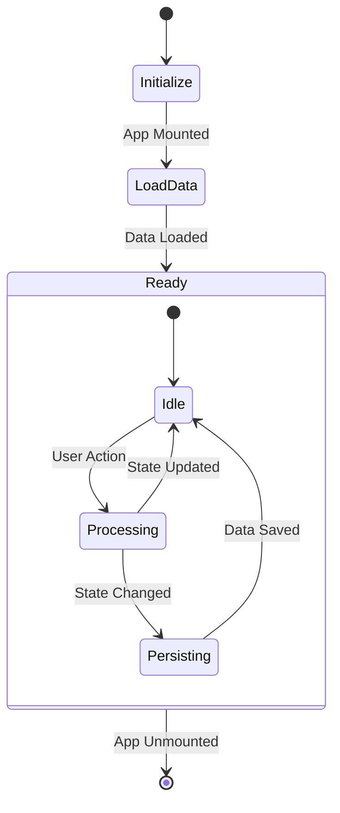
```mermaid
stateDiagram-v2
    [*] --> Initialize
    Initialize --> LoadData: App Mounted
    LoadData --> Ready: Data Loaded
    
    state Ready {
        [*] --> Idle
        Idle --> Processing: User Action
        Processing --> Idle: State Updated
        Processing --> Persisting: State Changed
        Persisting --> Idle: Data Saved
    }
    
    Ready --> [*]: App Unmounted
```

#### 5.2.2 TodoForm Component

- **Purpose**: Provides user interface for creating new tasks
- **Responsibilities**:
  - Capture user input for task description
  - Validate input before submission
  - Create new task objects with appropriate properties
  - Clear input after successful submission

- **Technologies**:
  - React (Functional component)
  - Controlled form inputs
  - Form submission handling

- **Key Interfaces**:
  - onSubmit handler for task creation
  - Input validation logic

- **Data Persistence**: None directly (passes data to parent)

- **Scaling Considerations**:
  - Form field expansion for additional task properties
  - Accessibility for keyboard-only users

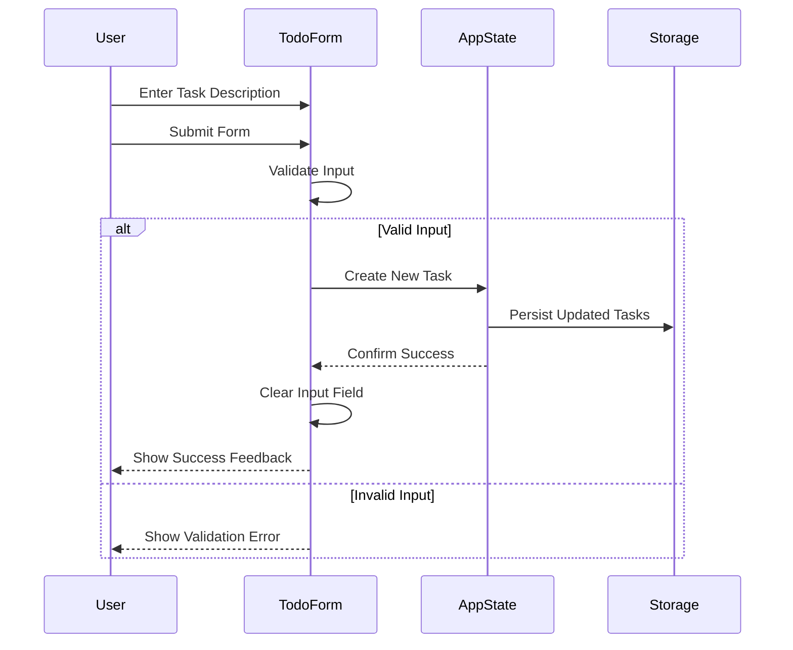
```mermaid
sequenceDiagram
    participant User
    participant TodoForm
    participant AppState
    participant Storage
    
    User->>TodoForm: Enter Task Description
    User->>TodoForm: Submit Form
    TodoForm->>TodoForm: Validate Input
    
    alt Valid Input
        TodoForm->>AppState: Create New Task
        AppState->>Storage: Persist Updated Tasks
        AppState-->>TodoForm: Confirm Success
        TodoForm->>TodoForm: Clear Input Field
        TodoForm-->>User: Show Success Feedback
    else Invalid Input
        TodoForm-->>User: Show Validation Error
    end
```

#### 5.2.3 TodoList Component

- **Purpose**: Renders the collection of todo items
- **Responsibilities**:
  - Display filtered list of tasks
  - Render individual TodoItem components
  - Handle empty state display
  - Apply filtering logic

- **Technologies**:
  - React (Functional component)
  - Array mapping for list generation
  - Conditional rendering

- **Key Interfaces**:
  - Filtered tasks array
  - Task manipulation functions passed to child components

- **Data Persistence**: None directly

- **Scaling Considerations**:
  - Virtual scrolling for large lists
  - Pagination if list grows significantly
  - Performance optimization for frequent re-renders

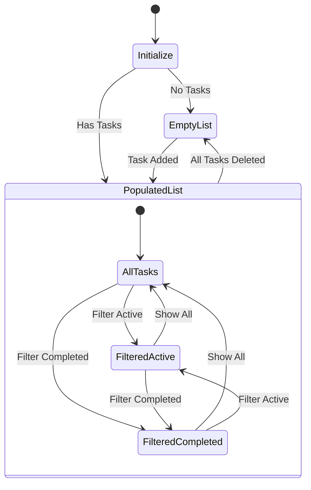
```mermaid
stateDiagram-v2
    [*] --> Initialize
    Initialize --> EmptyList: No Tasks
    Initialize --> PopulatedList: Has Tasks
    
    EmptyList --> PopulatedList: Task Added
    PopulatedList --> EmptyList: All Tasks Deleted
    
    state PopulatedList {
        [*] --> AllTasks
        AllTasks --> FilteredActive: Filter Active
        AllTasks --> FilteredCompleted: Filter Completed
        FilteredActive --> AllTasks: Show All
        FilteredCompleted --> AllTasks: Show All
        FilteredActive --> FilteredCompleted: Filter Completed
        FilteredCompleted --> FilteredActive: Filter Active
    }
```

#### 5.2.4 TodoItem Component

- **Purpose**: Renders and manages individual todo items
- **Responsibilities**:
  - Display task information
  - Provide controls for task manipulation (toggle, edit, delete)
  - Handle edit mode state
  - Visualize task status and priority

- **Technologies**:
  - React (Functional component)
  - Local component state for edit mode
  - Event handlers for user interactions

- **Key Interfaces**:
  - Task object with properties
  - Event handlers for task operations

- **Data Persistence**: None directly

- **Scaling Considerations**:
  - Optimizing re-renders with React.memo
  - Handling complex task property visualization

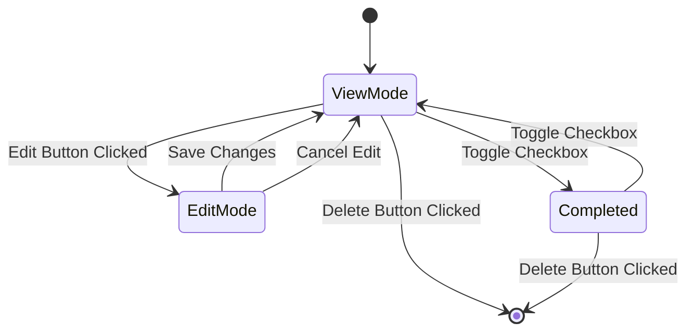
```mermaid
stateDiagram-v2
    [*] --> ViewMode
    
    ViewMode --> EditMode: Edit Button Clicked
    EditMode --> ViewMode: Save Changes
    EditMode --> ViewMode: Cancel Edit
    
    ViewMode --> Completed: Toggle Checkbox
    Completed --> ViewMode: Toggle Checkbox
    
    ViewMode --> [*]: Delete Button Clicked
    Completed --> [*]: Delete Button Clicked
```

#### 5.2.5 FilterControls Component

- **Purpose**: Provides interface for filtering tasks
- **Responsibilities**:
  - Display filter options (All, Active, Completed)
  - Track current filter selection
  - Apply visual indication of active filter
  - Trigger filter changes in parent component

- **Technologies**:
  - React (Functional component)
  - Button or tab-based interface

- **Key Interfaces**:
  - Current filter value
  - Filter change handler

- **Data Persistence**: None directly

- **Scaling Considerations**:
  - Expandability for additional filter types
  - Potential for filter combinations

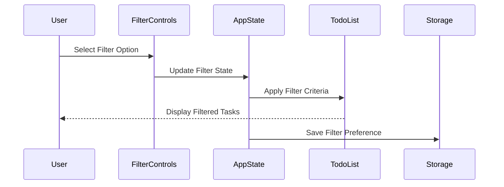
```mermaid
sequenceDiagram
    participant User
    participant FilterControls
    participant AppState
    participant TodoList
    
    User->>FilterControls: Select Filter Option
    FilterControls->>AppState: Update Filter State
    AppState->>TodoList: Apply Filter Criteria
    TodoList-->>User: Display Filtered Tasks
    AppState->>Storage: Save Filter Preference
```

#### 5.2.6 LocalStorageService

- **Purpose**: Manages data persistence using browser's localStorage
- **Responsibilities**:
  - Save task data to localStorage
  - Retrieve task data from localStorage
  - Handle serialization/deserialization
  - Manage storage errors and fallbacks

- **Technologies**:
  - Browser localStorage API
  - JSON parsing/stringifying
  - Error handling

- **Key Interfaces**:
  - saveData(key, data)
  - loadData(key)
  - clearData(key)

- **Data Persistence**: Primary persistence mechanism

- **Scaling Considerations**:
  - Storage size limitations (typically 5-10MB)
  - Performance with large datasets
  - Potential for IndexedDB upgrade path

```mermaid
sequenceDiagram
    participant AppState
    participant LocalStorageService
    participant BrowserStorage as Browser localStorage
    
    AppState->>LocalStorageService: saveData(tasks)
    LocalStorageService->>LocalStorageService: Serialize to JSON
    
    alt Storage Available
        LocalStorageService->>BrowserStorage: setItem(key, jsonData)
        BrowserStorage-->>LocalStorageService: Success
        LocalStorageService-->>AppState: Confirm Save
    else Storage Error
        LocalStorageService->>LocalStorageService: Handle Error
        LocalStorageService-->>AppState: Return Error Status
        AppState->>AppState: Enter Fallback Mode
    end
    
    AppState->>LocalStorageService: loadData()
    
    alt Data Exists
        LocalStorageService->>BrowserStorage: getItem(key)
        BrowserStorage-->>LocalStorageService: Return JSON String
        LocalStorageService->>LocalStorageService: Parse JSON
        LocalStorageService-->>AppState: Return Task Data
    else No Data or Error
        LocalStorageService-->>AppState: Return Empty Array
    end
```

### 5.3 TECHNICAL DECISIONS

#### 5.3.1 Architecture Style Decisions

| Decision | Selected Approach | Alternatives Considered | Rationale |
|----------|-------------------|-------------------------|-----------|
| Application Architecture | Client-side SPA | Server-rendered, Hybrid | Simplicity, no backend requirements, alignment with React paradigm |
| Component Structure | Functional components with hooks | Class components | Modern React practices, simpler code, better performance |
| State Management | React built-in hooks | Redux, MobX, Recoil | Application complexity doesn't warrant external state library |
| Data Persistence | Browser localStorage | IndexedDB, Remote API | Simplicity, no server dependency, sufficient for requirements |

The client-side SPA architecture was selected because:
- It aligns with the project's simplicity requirements
- Eliminates server dependencies, reducing complexity
- Provides immediate feedback for user actions
- Leverages React's component model effectively
- Enables offline functionality through localStorage

```mermaid
graph TD
    A[Architecture Decision] --> B{Backend Required?}
    B -->|No| C[Client-Side Only]
    B -->|Yes| D[Client-Server]
    
    C --> E{State Complexity?}
    E -->|Low| F[React Built-in State]
    E -->|High| G[External State Library]
    
    C --> H{Persistence Needs?}
    H -->|Simple| I[localStorage]
    H -->|Complex| J[IndexedDB]
    H -->|Remote| K[API Integration]
    
    F --> L[Selected Architecture]
    I --> L
```

#### 5.3.2 Communication Pattern Choices

| Pattern | Implementation | Alternatives | Justification |
|---------|----------------|--------------|---------------|
| Parent-Child Props | Component props passing | Context API, Redux | Simplest approach for shallow component tree |
| Event Handlers | Function references passed as props | Event emitters, Pub/Sub | Direct alignment with React's unidirectional data flow |
| State Lifting | State managed at App level | Distributed state | Simplifies data flow and persistence |

The parent-child props pattern was selected because:
- It follows React's recommended data flow patterns
- Maintains clear component relationships
- Simplifies debugging and testing
- Avoids unnecessary abstraction for a small application
- Provides predictable state updates

#### 5.3.3 Data Storage Solution Rationale

| Aspect | Selected Approach | Alternatives | Rationale |
|--------|-------------------|--------------|-----------|
| Storage Mechanism | localStorage | IndexedDB, SessionStorage, Remote API | Simplicity, browser support, persistence between sessions |
| Data Format | JSON | Custom format, Normalized | Native serialization support, human-readable |
| Storage Strategy | Full state persistence | Delta updates, Selective storage | Simplifies implementation, sufficient for data volume |

The localStorage solution was selected because:
- It meets the persistence requirements without server dependency
- Has excellent browser support
- Provides sufficient storage capacity for typical todo lists
- Offers simple API with synchronous access
- Enables offline functionality

```mermaid
graph TD
    A[Storage Decision] --> B{Server Available?}
    B -->|No| C[Client-Side Storage]
    B -->|Yes| D[Remote Storage]
    
    C --> E{Data Complexity?}
    E -->|Simple| F[localStorage]
    E -->|Complex| G[IndexedDB]
    
    C --> H{Persistence Requirements?}
    H -->|Session Only| I[sessionStorage]
    H -->|Between Sessions| J[localStorage/IndexedDB]
    
    F --> K[Selected Storage]
```

### 5.4 CROSS-CUTTING CONCERNS

#### 5.4.1 Error Handling Patterns

The application implements a comprehensive error handling strategy focused on:

- **Input Validation**: Preventing invalid data entry through form validation
- **Storage Error Handling**: Detecting and managing localStorage failures
- **Graceful Degradation**: Maintaining core functionality when persistence fails
- **User Feedback**: Providing clear error messages for actionable issues

| Error Type | Handling Approach | User Impact | Recovery Strategy |
|------------|-------------------|-------------|-------------------|
| Input Validation | Client-side validation with feedback | Immediate correction guidance | User-driven correction |
| Storage Access | Detection and fallback to in-memory | Notification of persistence issue | Automatic retry with exponential backoff |
| Data Parsing | Default to empty state with error logging | Potential data loss notification | Manual data recovery not supported |
| Rendering Errors | React error boundaries | Isolated component failures | Automatic recovery on next state change |

```mermaid
flowchart TD
    A[Error Detected] --> B{Error Type}
    
    B -->|Input Error| C[Show Validation Message]
    C --> D[Allow User Correction]
    
    B -->|Storage Error| E[Attempt Storage Diagnosis]
    E --> F{Storage Available?}
    F -->|Yes| G[Retry Operation]
    F -->|No| H[Enter In-Memory Mode]
    H --> I[Notify User of Persistence Issue]
    
    B -->|Data Format Error| J[Reset to Default State]
    J --> K[Log Error Details]
    K --> L[Notify User of Data Issue]
    
    B -->|Rendering Error| M[Activate Error Boundary]
    M --> N[Attempt Component Recovery]
    N --> O[Log Error Details]
```

#### 5.4.2 Performance Requirements

The React Todo List application has the following performance requirements:

- **Initial Load Time**: Application should be interactive in under 2 seconds
- **Interaction Response**: UI should respond to user actions in under 100ms
- **Storage Operations**: localStorage operations should complete in under 100ms
- **Rendering Performance**: List rendering should maintain 60fps even with 100+ items

| Performance Aspect | Target Metric | Optimization Approach |
|--------------------|---------------|------------------------|
| Initial Load | < 2 seconds | Minimal dependencies, code splitting |
| Task Creation | < 100ms response | Optimized state updates |
| List Rendering | 60fps scrolling | Virtualization for large lists, memoization |
| Filter Application | < 50ms | Efficient filtering algorithms |

Performance optimization techniques include:
- React.memo for pure components to prevent unnecessary re-renders
- Debouncing for frequent user inputs
- Batched state updates
- Efficient key usage in list rendering
- Conditional rendering optimization

## 6. SYSTEM COMPONENTS DESIGN

### 6.1 COMPONENT ARCHITECTURE

#### 6.1.1 Component Hierarchy

The React Todo List application follows a hierarchical component structure that promotes separation of concerns and reusability:

```mermaid
graph TD
    App[App Container] --> TodoForm[TodoForm]
    App --> TodoList[TodoList]
    App --> FilterControls[FilterControls]
    TodoList --> TodoItem1[TodoItem]
    TodoList --> TodoItem2[TodoItem]
    TodoList --> TodoItemN[TodoItem ...]
    
    subgraph "Utility Components"
    Button[Button]
    Checkbox[Checkbox]
    Input[Input]
    end
    
    TodoForm -.-> Input
    TodoForm -.-> Button
    TodoItem1 -.-> Checkbox
    TodoItem1 -.-> Button
```

#### 6.1.2 Component Responsibilities

| Component | Primary Responsibility | Props Interface | State Management |
|-----------|------------------------|----------------|------------------|
| App | Application container and state orchestration | None | Global application state (tasks, filters) |
| TodoForm | Task creation interface | `onAddTask` | Form input state |
| TodoList | Renders collection of tasks | `tasks`, `onToggleTask`, `onDeleteTask`, `onEditTask` | None |
| TodoItem | Individual task display and interaction | `task`, `onToggle`, `onDelete`, `onEdit` | Edit mode state |
| FilterControls | Task filtering interface | `currentFilter`, `onFilterChange` | None |
| Button | Reusable button component | `onClick`, `children`, `variant` | None |
| Checkbox | Reusable checkbox component | `checked`, `onChange`, `label` | None |
| Input | Reusable input component | `value`, `onChange`, `placeholder` | None |

#### 6.1.3 Component Communication

```mermaid
sequenceDiagram
    participant User
    participant App
    participant TodoForm
    participant TodoList
    participant TodoItem
    participant Storage
    
    User->>TodoForm: Enter task & submit
    TodoForm->>App: Call onAddTask(taskText)
    App->>App: Update tasks state
    App->>Storage: Save updated tasks
    App->>TodoList: Pass updated tasks
    TodoList->>TodoItem: Render new task
    
    User->>TodoItem: Toggle completion
    TodoItem->>App: Call onToggleTask(id)
    App->>App: Update task status
    App->>Storage: Save updated tasks
    App->>TodoList: Pass updated tasks
    TodoList->>TodoItem: Re-render with new status
```

### 6.2 COMPONENT SPECIFICATIONS

#### 6.2.1 App Component

**Purpose**: Main application container that manages global state and orchestrates component interactions.

**Props**: None

**State**:
- `tasks`: Array of task objects
- `filter`: Current filter selection (all/active/completed)

**Methods**:
- `addTask(text)`: Creates and adds a new task
- `toggleTask(id)`: Toggles completion status of a task
- `deleteTask(id)`: Removes a task
- `editTask(id, newText)`: Updates task text
- `setFilter(filterType)`: Updates current filter
- `getFilteredTasks()`: Returns tasks filtered by current filter

**Lifecycle**:
- On mount: Load tasks from localStorage
- On tasks update: Save tasks to localStorage

**Rendering**:
```
<div className="todo-app">
  <h1>Todo List</h1>
  <TodoForm onAddTask={addTask} />
  <FilterControls currentFilter={filter} onFilterChange={setFilter} />
  <TodoList 
    tasks={getFilteredTasks()} 
    onToggleTask={toggleTask}
    onDeleteTask={deleteTask}
    onEditTask={editTask}
  />
</div>
```

#### 6.2.2 TodoForm Component

**Purpose**: Provides interface for creating new tasks.

**Props**:
- `onAddTask`: Function to call when a new task is submitted

**State**:
- `inputValue`: Current value of the input field

**Methods**:
- `handleSubmit(event)`: Handles form submission
- `handleChange(event)`: Updates input value on change

**Validation**:
- Prevents empty task submission
- Trims whitespace from input

**Rendering**:
```
<form className="todo-form" onSubmit={handleSubmit}>
  <Input
    value={inputValue}
    onChange={handleChange}
    placeholder="Add a new task..."
  />
  <Button type="submit">Add Task</Button>
</form>
```

#### 6.2.3 TodoList Component

**Purpose**: Renders the collection of todo items.

**Props**:
- `tasks`: Array of task objects to display
- `onToggleTask`: Function to toggle task completion
- `onDeleteTask`: Function to delete a task
- `onEditTask`: Function to edit a task

**Rendering Logic**:
- Maps through tasks array to render TodoItem components
- Handles empty state display
- Applies key prop for efficient rendering

**Rendering**:
```
<div className="todo-list">
  {tasks.length === 0 ? (
    <div className="empty-state">No tasks to display</div>
  ) : (
    tasks.map(task => (
      <TodoItem
        key={task.id}
        task={task}
        onToggle={onToggleTask}
        onDelete={onDeleteTask}
        onEdit={onEditTask}
      />
    ))
  )}
</div>
```

#### 6.2.4 TodoItem Component

**Purpose**: Renders and manages individual todo items.

**Props**:
- `task`: Task object with id, text, completed properties
- `onToggle`: Function to toggle completion status
- `onDelete`: Function to delete the task
- `onEdit`: Function to edit the task

**State**:
- `isEditing`: Boolean indicating edit mode
- `editText`: Current text in edit mode

**Methods**:
- `handleToggle()`: Calls onToggle with task id
- `handleDelete()`: Calls onDelete with task id
- `handleEditStart()`: Enters edit mode
- `handleEditChange(event)`: Updates editText state
- `handleEditSubmit()`: Submits edited text and exits edit mode
- `handleEditCancel()`: Cancels edit mode without changes

**Rendering**:
```
<div className={`todo-item ${task.completed ? 'completed' : ''}`}>
  {isEditing ? (
    <form onSubmit={handleEditSubmit}>
      <Input value={editText} onChange={handleEditChange} />
      <Button type="submit">Save</Button>
      <Button type="button" onClick={handleEditCancel}>Cancel</Button>
    </form>
  ) : (
    <>
      <Checkbox checked={task.completed} onChange={handleToggle} />
      <span className="todo-text">{task.text}</span>
      <div className="todo-actions">
        <Button onClick={handleEditStart}>Edit</Button>
        <Button onClick={handleDelete}>Delete</Button>
      </div>
    </>
  )}
</div>
```

#### 6.2.5 FilterControls Component

**Purpose**: Provides interface for filtering tasks.

**Props**:
- `currentFilter`: Current active filter
- `onFilterChange`: Function to change the filter

**Methods**:
- `handleFilterChange(filterType)`: Calls onFilterChange with new filter

**Rendering**:
```
<div className="filter-controls">
  <Button 
    onClick={() => handleFilterChange('all')}
    className={currentFilter === 'all' ? 'active' : ''}
  >
    All
  </Button>
  <Button 
    onClick={() => handleFilterChange('active')}
    className={currentFilter === 'active' ? 'active' : ''}
  >
    Active
  </Button>
  <Button 
    onClick={() => handleFilterChange('completed')}
    className={currentFilter === 'completed' ? 'active' : ''}
  >
    Completed
  </Button>
</div>
```

### 6.3 DATA STRUCTURES

#### 6.3.1 Task Object Schema

| Property | Type | Description | Example |
|----------|------|-------------|---------|
| id | String | Unique identifier | "task-1234567890" |
| text | String | Task description | "Buy groceries" |
| completed | Boolean | Completion status | false |
| priority | String (optional) | Task priority | "high" |
| createdAt | Number | Creation timestamp | 1623456789000 |

**Sample Task Object**:
```
{
  id: "task-1623456789",
  text: "Complete React project",
  completed: false,
  priority: "high",
  createdAt: 1623456789000
}
```

#### 6.3.2 Application State Structure

| State Property | Type | Description | Default Value |
|----------------|------|-------------|---------------|
| tasks | Array | Collection of task objects | [] |
| filter | String | Current filter selection | "all" |

**Sample Application State**:
```
{
  tasks: [
    {
      id: "task-1623456789",
      text: "Complete React project",
      completed: false,
      priority: "high",
      createdAt: 1623456789000
    },
    {
      id: "task-1623456790",
      text: "Buy groceries",
      completed: true,
      priority: "medium",
      createdAt: 1623456790000
    }
  ],
  filter: "all"
}
```

#### 6.3.3 LocalStorage Data Format

| Storage Key | Value Type | Description |
|-------------|------------|-------------|
| react-todo-list-tasks | JSON String | Serialized tasks array |
| react-todo-list-filter | String | Current filter selection |

**Sample LocalStorage Entry**:
```
// Key: react-todo-list-tasks
// Value:
[
  {
    "id": "task-1623456789",
    "text": "Complete React project",
    "completed": false,
    "priority": "high",
    "createdAt": 1623456789000
  },
  {
    "id": "task-1623456790",
    "text": "Buy groceries",
    "completed": true,
    "priority": "medium",
    "createdAt": 1623456790000
  }
]
```

### 6.4 UTILITY SERVICES

#### 6.4.1 LocalStorageService

**Purpose**: Manages data persistence using browser's localStorage.

**Methods**:
- `saveData(key, data)`: Serializes and saves data to localStorage
- `loadData(key, defaultValue)`: Loads and parses data from localStorage
- `removeData(key)`: Removes data from localStorage
- `clearAll()`: Clears all application data from localStorage

**Error Handling**:
- Catches and logs storage exceptions
- Returns default values when data cannot be retrieved
- Implements storage availability detection

**Usage Example**:
```
// Save tasks
LocalStorageService.saveData('react-todo-list-tasks', tasks);

// Load tasks
const savedTasks = LocalStorageService.loadData('react-todo-list-tasks', []);
```

#### 6.4.2 TaskService

**Purpose**: Provides utility functions for task manipulation.

**Methods**:
- `createTask(text, priority)`: Creates a new task object with unique ID
- `toggleTaskStatus(tasks, id)`: Returns new array with toggled task status
- `updateTaskText(tasks, id, newText)`: Returns new array with updated task text
- `deleteTask(tasks, id)`: Returns new array with task removed
- `filterTasks(tasks, filterType)`: Returns filtered array based on filter type

**Usage Example**:
```
// Create a new task
const newTask = TaskService.createTask("Learn React", "high");

// Filter tasks
const activeTasks = TaskService.filterTasks(tasks, "active");
```

#### 6.4.3 IdGenerator

**Purpose**: Generates unique identifiers for tasks.

**Methods**:
- `generate()`: Returns a unique ID string
- `generateWithPrefix(prefix)`: Returns a unique ID with specified prefix

**Implementation**:
Uses combination of timestamp and random values to ensure uniqueness.

**Usage Example**:
```
// Generate a task ID
const taskId = IdGenerator.generateWithPrefix('task-');
```

### 6.5 COMPONENT INTERACTIONS

#### 6.5.1 Task Creation Flow

```mermaid
sequenceDiagram
    participant User
    participant TodoForm
    participant App
    participant TaskService
    participant LocalStorageService
    
    User->>TodoForm: Enter task text
    User->>TodoForm: Submit form
    TodoForm->>TodoForm: Validate input
    TodoForm->>App: Call onAddTask(text)
    App->>TaskService: createTask(text)
    TaskService-->>App: Return new task object
    App->>App: Update tasks state
    App->>LocalStorageService: saveData('tasks', updatedTasks)
    App->>TodoList: Re-render with new task
    TodoList-->>User: Show updated list
```

#### 6.5.2 Task Completion Toggle Flow

```mermaid
sequenceDiagram
    participant User
    participant TodoItem
    participant App
    participant TaskService
    participant LocalStorageService
    
    User->>TodoItem: Click checkbox
    TodoItem->>App: Call onToggle(taskId)
    App->>TaskService: toggleTaskStatus(tasks, taskId)
    TaskService-->>App: Return updated tasks array
    App->>App: Update tasks state
    App->>LocalStorageService: saveData('tasks', updatedTasks)
    App->>TodoList: Re-render with updated task
    TodoList->>TodoItem: Re-render with new status
    TodoItem-->>User: Show updated status
```

#### 6.5.3 Task Filtering Flow

```mermaid
sequenceDiagram
    participant User
    participant FilterControls
    participant App
    participant TaskService
    participant LocalStorageService
    
    User->>FilterControls: Click filter option
    FilterControls->>App: Call onFilterChange(filterType)
    App->>App: Update filter state
    App->>LocalStorageService: saveData('filter', newFilter)
    App->>TaskService: filterTasks(tasks, filterType)
    TaskService-->>App: Return filtered tasks
    App->>TodoList: Re-render with filtered tasks
    TodoList-->>User: Show filtered list
```

### 6.6 STYLING APPROACH

#### 6.6.1 CSS Organization

| File | Purpose | Components Styled |
|------|---------|-------------------|
| index.css | Global styles and variables | App-wide styles |
| App.css | Main container styling | App component |
| TodoForm.css | Form styling | TodoForm component |
| TodoList.css | List container styling | TodoList component |
| TodoItem.css | Individual task styling | TodoItem component |
| FilterControls.css | Filter buttons styling | FilterControls component |

#### 6.6.2 Styling Methodology

The application will use CSS Modules for component-specific styling with the following benefits:
- Local scope for CSS classes
- Prevention of style conflicts
- Improved maintainability
- Clear component-to-style mapping

#### 6.6.3 Responsive Design Approach

| Breakpoint | Target Devices | Layout Adjustments |
|------------|----------------|-------------------|
| Default (>= 768px) | Desktop, Laptop | Standard layout with comfortable spacing |
| < 768px | Tablets | Reduced margins, optimized button sizes |
| < 480px | Mobile phones | Single column layout, full-width inputs |

**Responsive Techniques**:
- Fluid layouts using percentage widths
- Media queries for breakpoint-specific adjustments
- Flexible font sizing with rem units
- Touch-friendly target sizes for mobile

#### 6.6.4 Visual States

| Component | State | Visual Indicator |
|-----------|-------|------------------|
| TodoItem | Completed | Strikethrough text, muted color, checked checkbox |
| TodoItem | Incomplete | Normal text, unchecked checkbox |
| TodoItem | Editing | Input field with task text, save/cancel buttons |
| FilterButton | Active | Highlighted background, contrasting text |
| FilterButton | Inactive | Standard button styling |
| TodoForm | Valid | Standard input styling |
| TodoForm | Invalid | Red border or highlight, error message |

### 6.1 CORE SERVICES ARCHITECTURE

Core Services Architecture is not applicable for this system as it is a simple, client-side only React application without microservices or distributed components.

The React Todo List application follows a monolithic frontend architecture pattern where:

1. All application logic runs in the user's browser
2. No backend services or APIs are required
3. Data persistence is handled through browser's localStorage
4. All components operate within a single JavaScript runtime

#### 6.1.1 SIMPLIFIED SERVICE MODEL

While not a true microservices architecture, the application does implement a logical separation of concerns through React components and utility services:

| Logical Service | Responsibility | Implementation Approach |
|-----------------|----------------|-------------------------|
| UI Components | User interface rendering | React functional components |
| State Management | Application data handling | React hooks (useState, useEffect) |
| Data Persistence | Task storage and retrieval | Browser localStorage API |
| Task Operations | Business logic for tasks | Utility functions and custom hooks |

```mermaid
graph TD
    A[Browser Runtime] --> B[React Application]
    
    subgraph "Logical Services"
    B --> C[UI Service]
    B --> D[State Management Service]
    B --> E[Data Persistence Service]
    B --> F[Task Operations Service]
    end
    
    C --> G[User Interface]
    D <--> E
    D <--> F
    E <--> H[Browser LocalStorage]
```

#### 6.1.2 ALTERNATIVE CONSIDERATIONS

For future scalability, the following architectural approaches were considered but deemed unnecessary for the current requirements:

| Architecture Pattern | Why Not Implemented | Potential Future Application |
|----------------------|---------------------|------------------------------|
| Backend API Services | No multi-user or complex data requirements | Would enable user accounts and shared lists |
| State Management Library | Application state is simple | Would help manage complex state interactions |
| PWA Implementation | Basic web application is sufficient | Would enable offline capabilities beyond localStorage |

#### 6.1.3 RESILIENCE CONSIDERATIONS

Despite being a simple application, the following resilience patterns are implemented:

| Resilience Pattern | Implementation Approach |
|--------------------|-------------------------|
| Data Validation | Client-side input validation prevents invalid task creation |
| Error Boundaries | React error boundaries prevent total application crashes |
| Storage Fallbacks | Default empty state when localStorage is unavailable |
| Data Recovery | Graceful handling of corrupted localStorage data |

```mermaid
flowchart TD
    A[Application Start] --> B{LocalStorage Available?}
    
    B -->|Yes| C[Load Data]
    B -->|No| D[Initialize Empty State]
    
    C --> E{Valid Data Format?}
    E -->|Yes| F[Initialize with Saved Data]
    E -->|No| G[Initialize with Default Data]
    
    F & G & D --> H[Application Running]
    
    H --> I{State Change}
    I --> J{LocalStorage Available?}
    J -->|Yes| K[Save State]
    J -->|No| L[Continue In-Memory Only]
    
    K & L --> H
```

Since this is a client-side only application with no distributed components, traditional service architecture concepts like service discovery, load balancing, circuit breakers, and inter-service communication are not applicable. The application's simplicity is intentional, focusing on core React patterns and browser capabilities to deliver a straightforward todo list experience.

### 6.2 DATABASE DESIGN

For the React Todo List application, a traditional database system is not utilized. Instead, the application leverages the browser's localStorage API for data persistence. This approach aligns with the client-side only architecture and eliminates the need for server-side database components.

#### 6.2.1 SCHEMA DESIGN

While not a formal database schema, the application's data structure is organized as follows:

| Storage Key | Data Type | Purpose |
|-------------|-----------|---------|
| react-todo-list-tasks | JSON Array | Stores the collection of task objects |
| react-todo-list-filter | String | Stores the current filter preference |

**Task Object Structure:**

| Property | Data Type | Description | Constraints |
|----------|-----------|-------------|------------|
| id | String | Unique task identifier | Required, unique |
| text | String | Task description | Required, non-empty |
| completed | Boolean | Completion status | Required |
| priority | String | Task priority level | Optional (high/medium/low) |
| createdAt | Number | Creation timestamp | Required |

**Entity Relationship Diagram:**

```mermaid
erDiagram
    TASK {
        string id PK
        string text
        boolean completed
        string priority
        number createdAt
    }
    
    FILTER {
        string value
    }
    
    TASK ||--o{ FILTER : "filtered-by"
```

**Indexing Strategy:**
- Tasks are indexed by their unique `id` property in memory
- No formal database indexing is required with localStorage

**Data Storage Structure:**

```mermaid
graph TD
    A[Browser LocalStorage] --> B[react-todo-list-tasks]
    A --> C[react-todo-list-filter]
    
    B --> D[Task Array]
    D --> E[Task 1]
    D --> F[Task 2]
    D --> G[Task n...]
    
    C --> H[Filter Value]
```

#### 6.2.2 DATA MANAGEMENT

**Data Storage and Retrieval Mechanisms:**

| Operation | Implementation | Timing |
|-----------|----------------|--------|
| Initial Load | Load from localStorage on application start | Application initialization |
| Data Saving | Save to localStorage after state changes | After each state mutation |
| Data Clearing | Remove from localStorage on clear action | User-triggered |

**Data Flow Diagram:**

```mermaid
flowchart TD
    A[User Interface] -->|Create/Update/Delete| B[React State]
    B -->|State Change| C[Serialization Layer]
    C -->|JSON String| D[LocalStorage API]
    D -->|Store| E[Browser Storage]
    
    F[Application Start] -->|Initialize| G[LocalStorage API]
    G -->|Retrieve| E
    G -->|JSON String| H[Deserialization Layer]
    H -->|Task Objects| B
    B -->|Render| A
```

**Versioning Strategy:**
- Simple version tag stored with data to handle schema migrations
- Default to empty state if version mismatch detected

**Data Migration Procedures:**
- Migration functions to transform data between versions
- Executed on application initialization when version mismatch detected

**Caching Policies:**
- In-memory state serves as application cache
- No additional caching layer required

#### 6.2.3 COMPLIANCE CONSIDERATIONS

**Data Retention:**
- Data persists indefinitely in localStorage until explicitly cleared
- No automatic expiration of data
- User has full control to clear data through application UI

**Privacy Controls:**
- All data remains on the client device
- No data transmission to external servers
- No personally identifiable information collected

**Data Ownership:**

| Data Category | Owner | Access Control |
|---------------|-------|----------------|
| Task Data | End User | Browser-enforced isolation |
| Application Settings | End User | Browser-enforced isolation |

**Backup Mechanisms:**
- No automatic backup functionality
- Users responsible for their own data backup
- Future enhancement could include export/import functionality

#### 6.2.4 PERFORMANCE OPTIMIZATION

**Storage Optimization:**

| Technique | Implementation | Benefit |
|-----------|----------------|---------|
| Minimal Data Structure | Store only essential task properties | Reduces storage footprint |
| Batch Updates | Save all tasks in single operation | Minimizes storage API calls |
| Lazy Loading | Load data only when needed | Improves startup performance |

**Query Optimization:**
- In-memory filtering for task lists
- Memoization of filtered results to prevent redundant processing

**Performance Considerations:**

```mermaid
flowchart TD
    A[Performance Considerations] --> B[Storage Size Limits]
    A --> C[Serialization Overhead]
    A --> D[Parse/Stringify Performance]
    
    B --> E[Monitor Total Size]
    B --> F[Implement Size Limits]
    
    C --> G[Minimize State Changes]
    C --> H[Batch Updates]
    
    D --> I[Optimize Task Object Structure]
    D --> J[Use Efficient Data Types]
```

**Storage Limits:**
- localStorage typically limited to 5-10MB per domain
- Application monitors storage usage
- Implements graceful degradation when limits approached

#### 6.2.5 ALTERNATIVE PERSISTENCE OPTIONS

For future scalability, the following alternatives were considered:

| Storage Option | Advantages | Limitations | Use Case |
|----------------|------------|-------------|----------|
| IndexedDB | Larger storage capacity, complex queries | More complex implementation | Large task collections |
| WebSQL | SQL query capabilities | Deprecated, limited browser support | Not recommended |
| Remote API + Database | Multi-device sync, backup | Requires backend infrastructure | Future multi-user version |

**Potential Future Database Architecture:**

```mermaid
flowchart TD
    A[Client Application] -->|API Requests| B[Backend API]
    B -->|CRUD Operations| C[Database]
    
    subgraph "Database Layer"
    C --> D[Tasks Table]
    C --> E[Users Table]
    C --> F[Settings Table]
    end
    
    G[LocalStorage] -.->|Offline Cache| A
    A -->|Sync| G
```

The current localStorage implementation provides a simple, effective solution for the application's requirements while maintaining a client-side only architecture. This approach eliminates server dependencies while still providing data persistence between sessions.

### 6.3 INTEGRATION ARCHITECTURE

Integration Architecture is not applicable for this system as it is a simple, client-side only React application with no external system dependencies. The React Todo List application is designed as a standalone, browser-based solution that:

1. Runs entirely in the user's browser
2. Uses browser's localStorage for data persistence
3. Does not communicate with any backend services or APIs
4. Does not integrate with external systems or third-party services

#### 6.3.1 SIMPLIFIED INTEGRATION MODEL

While the application does not have external integrations, the following diagram illustrates the internal integration between the application components and the browser's localStorage API:

```mermaid
flowchart TD
    A[React Application] <-->|localStorage API| B[Browser Storage]
    
    subgraph "React Application Components"
    C[UI Components] <--> D[State Management]
    D <--> E[LocalStorage Service]
    end
    
    E <-->|read/write| B
    
    subgraph "Browser Environment"
    B
    F[DOM]
    end
    
    C <-->|render/events| F
```

#### 6.3.2 POTENTIAL FUTURE INTEGRATIONS

For future scalability, the following integration points could be considered:

| Integration Type | Purpose | Implementation Approach |
|------------------|---------|-------------------------|
| Backend API | Multi-device synchronization | RESTful API with JWT authentication |
| Cloud Storage | Data backup and recovery | OAuth-based cloud storage integration |
| Notification Services | Task reminders | Web Push API integration |
| Calendar Systems | Task scheduling | iCalendar format export/import |

#### 6.3.3 BROWSER API INTEGRATION

The application does integrate with browser APIs, which can be considered a form of system integration:

| Browser API | Purpose | Integration Method |
|-------------|---------|-------------------|
| localStorage API | Data persistence | Direct JavaScript API calls |
| DOM API | User interface rendering | React abstraction layer |
| History API | URL-based filtering (optional) | React Router integration |

```mermaid
sequenceDiagram
    participant User
    participant React as React Application
    participant Storage as localStorage API
    
    User->>React: Open Application
    React->>Storage: getData("react-todo-list-tasks")
    Storage-->>React: Return Saved Tasks
    React-->>User: Display Task List
    
    User->>React: Create/Update/Delete Task
    React->>React: Update Internal State
    React->>Storage: setData("react-todo-list-tasks", updatedTasks)
    Storage-->>React: Confirm Storage
    React-->>User: Update UI
```

#### 6.3.4 OFFLINE CAPABILITIES

Without external integrations, the application naturally provides offline capabilities:

| Capability | Implementation | Limitation |
|------------|----------------|------------|
| Offline Operation | All functionality works without network | Single-device only |
| Data Persistence | localStorage maintains data between sessions | Browser storage limits apply |
| State Recovery | Application state restored on reload | No cross-device synchronization |

```mermaid
stateDiagram-v2
    [*] --> Online
    Online --> Offline: Network Lost
    Offline --> Online: Network Restored
    
    state Online {
        [*] --> NormalOperation
        NormalOperation --> DataPersistence: State Changes
        DataPersistence --> NormalOperation: Storage Complete
    }
    
    state Offline {
        [*] --> OfflineOperation
        OfflineOperation --> LocalPersistence: State Changes
        LocalPersistence --> OfflineOperation: Local Storage Complete
    }
    
    Online --> [*]: Application Closed
    Offline --> [*]: Application Closed
```

#### 6.3.5 PROGRESSIVE ENHANCEMENT STRATEGY

The application follows a progressive enhancement approach that could be extended to include more advanced integrations in the future:

| Enhancement Level | Features | Integration Requirements |
|-------------------|----------|--------------------------|
| Basic (Current) | Core task management with localStorage | None |
| Enhanced | Offline PWA with improved storage | Service Worker API |
| Advanced | Multi-device synchronization | Backend API + Authentication |
| Enterprise | Team collaboration, integrations | Full API ecosystem |

```mermaid
flowchart TD
    A[Current Implementation] --> B[Progressive Web App]
    B --> C[Backend Integration]
    C --> D[External Service Integration]
    
    subgraph "Current Scope"
    A
    end
    
    subgraph "Future Possibilities"
    B
    C
    D
    end
    
    E[localStorage] --- A
    F[Service Worker + IndexedDB] --- B
    G[REST API + Authentication] --- C
    H[OAuth + Third-party APIs] --- D
```

The current implementation deliberately avoids external integrations to maintain simplicity, eliminate dependencies, and provide a focused, reliable task management experience. This approach aligns with the project requirements for a lightweight, browser-based todo list application without the complexity of server communication or external service dependencies.

### 6.4 SECURITY ARCHITECTURE

Detailed Security Architecture is not applicable for this system as it is a client-side only React application with no backend services, user authentication, or sensitive data handling requirements. The application runs entirely in the user's browser and uses localStorage for data persistence, which inherently limits security concerns to browser-level protections.

Instead, the following standard security practices will be implemented:

#### 6.4.1 CLIENT-SIDE SECURITY CONSIDERATIONS

| Security Concern | Implementation Approach | Rationale |
|------------------|-------------------------|-----------|
| Input Validation | Client-side validation of all user inputs | Prevents injection of malicious content into task data |
| Output Encoding | React's built-in XSS protection | Mitigates cross-site scripting risks in rendered content |
| Content Security | No use of dangerous JavaScript functions | Avoids eval(), innerHTML and other unsafe practices |
| Local Storage | No sensitive data stored in localStorage | Task data is considered low-sensitivity |

#### 6.4.2 DATA PROTECTION

| Protection Measure | Implementation | Limitation |
|--------------------|----------------|------------|
| Data Isolation | Browser's same-origin policy | Prevents other sites from accessing app data |
| No Sensitive Data | Application design avoids collecting sensitive information | Reduces risk profile |
| Clear Data Option | User interface to clear all stored data | Provides user control over persistence |
| Data Validation | Schema validation before storage/retrieval | Prevents corruption or injection |

```mermaid
flowchart TD
    A[User Input] --> B{Input Validation}
    B -->|Valid| C[React State]
    B -->|Invalid| D[Error Message]
    
    C --> E{State Change}
    E --> F[Sanitize Data]
    F --> G[localStorage API]
    
    G --> H[Browser Storage]
    
    I[Application Load] --> J[Load from localStorage]
    J --> K{Validate Data Structure}
    K -->|Valid| L[Populate State]
    K -->|Invalid| M[Initialize Empty State]
```

#### 6.4.3 BROWSER SECURITY CONTEXT

The application operates within the browser's security sandbox, which provides several inherent protections:

| Security Layer | Protection Provided | Application Benefit |
|----------------|---------------------|---------------------|
| Same-Origin Policy | Prevents cross-origin data access | Protects localStorage data from other sites |
| Content Security | Browser-enforced resource restrictions | Limits potential for content injection |
| Sandboxed Execution | Isolated JavaScript runtime | Prevents access to system resources |

```mermaid
graph TD
    subgraph "Browser Security Sandbox"
        A[React Todo Application] --> B[localStorage API]
        A --> C[DOM API]
        
        B --> D[Origin-Isolated Storage]
        C --> E[Rendered UI]
    end
    
    F[Other Websites/Applications] -.->|Blocked by Same-Origin Policy| D
    G[User] -->|Interacts with| E
```

#### 6.4.4 FUTURE SECURITY CONSIDERATIONS

If the application were to be expanded to include multi-user functionality or backend services, the following security measures would be implemented:

| Security Area | Future Implementation | When Required |
|---------------|------------------------|--------------|
| Authentication | JWT-based authentication with secure storage | If user accounts are added |
| Authorization | Role-based access control for shared lists | If collaboration features are added |
| API Security | HTTPS, rate limiting, and request validation | If backend API is implemented |
| Data Encryption | At-rest encryption for sensitive data | If personal/sensitive information is stored |

```mermaid
sequenceDiagram
    participant User
    participant Browser
    participant LocalStorage
    
    User->>Browser: Open Application
    Browser->>LocalStorage: Request Data
    LocalStorage-->>Browser: Return Task Data
    Browser-->>User: Display Tasks
    
    User->>Browser: Create/Edit Task
    Browser->>Browser: Validate Input
    Browser->>LocalStorage: Store Updated Data
    Browser-->>User: Update UI
    
    User->>Browser: Clear Data
    Browser->>LocalStorage: Remove Application Data
    Browser-->>User: Confirm Data Cleared
```

#### 6.4.5 SECURITY TESTING APPROACH

Even for this simple application, basic security testing will be performed:

| Test Category | Test Approach | Purpose |
|---------------|--------------|---------|
| Input Validation | Attempt to inject script tags and malicious content | Verify XSS protection |
| localStorage Limits | Test with large data volumes | Ensure graceful handling of storage limits |
| Data Integrity | Manually modify localStorage data | Verify application handles corrupt data |
| Browser Compatibility | Test across browsers | Ensure consistent security behavior |

The React Todo List application intentionally maintains a minimal security footprint by:
1. Operating entirely client-side
2. Not collecting sensitive information
3. Not requiring authentication
4. Using browser-native storage mechanisms
5. Leveraging React's built-in security features

This approach aligns with the application's simplicity requirements while maintaining appropriate security practices for its context and use case.

### 6.5 MONITORING AND OBSERVABILITY

Detailed Monitoring Architecture is not applicable for this system as it is a simple, client-side only React application with no backend services or distributed components. The application runs entirely in the user's browser and uses localStorage for data persistence, which inherently limits the need for complex monitoring infrastructure.

Instead, the following basic monitoring and observability practices will be implemented:

#### 6.5.1 CLIENT-SIDE MONITORING APPROACH

| Monitoring Aspect | Implementation Approach | Purpose |
|-------------------|-------------------------|---------|
| Error Tracking | Console error logging | Capture runtime errors during development |
| Performance Monitoring | React DevTools profiling | Identify component rendering bottlenecks |
| User Interaction Tracking | Optional event logging | Understand feature usage patterns |
| Local Storage Usage | Storage quota monitoring | Prevent exceeding browser storage limits |

```mermaid
flowchart TD
    A[Client-Side Monitoring] --> B[Development Monitoring]
    A --> C[Production Monitoring]
    
    subgraph "Development Environment"
    B --> D[React DevTools]
    B --> E[Console Logging]
    B --> F[Performance Profiling]
    end
    
    subgraph "Production Environment"
    C --> G[Error Boundary Logging]
    C --> H[Storage Quota Checks]
    C --> I[Optional Analytics]
    end
```

#### 6.5.2 HEALTH CHECKS AND ERROR HANDLING

| Health Check Type | Implementation | Response |
|-------------------|----------------|----------|
| Application Initialization | Startup validation | Reset to default state if corrupted |
| LocalStorage Availability | Storage detection | Fallback to in-memory operation |
| Data Integrity | Schema validation | Repair or reset corrupted data |

**Error Boundary Implementation:**

```mermaid
flowchart TD
    A[React Application] --> B[Error Boundary Component]
    B --> C[App Container]
    
    C --> D[Component Tree]
    
    E[Runtime Error] -->|Triggers| B
    B -->|Captures| E
    B -->|Renders| F[Fallback UI]
    B -->|Logs| G[Error Details]
    
    H[User Action] -->|Triggers| I[Recovery Attempt]
    I -->|Resets| C
```

#### 6.5.3 PERFORMANCE METRICS

| Metric Category | Key Metrics | Target Values |
|-----------------|-------------|---------------|
| Rendering Performance | Initial Load Time | < 2 seconds |
| | Component Render Time | < 100ms per component |
| | Re-render Frequency | Minimize unnecessary renders |
| User Interaction | Task Creation Time | < 500ms response |
| | Filter Application Time | < 300ms response |
| Storage Operations | Save Operation Time | < 100ms |
| | Load Operation Time | < 200ms |

**Performance Monitoring Flow:**

```mermaid
sequenceDiagram
    participant User
    participant App
    participant Performance as Performance Monitor
    participant Storage
    
    User->>App: Interact with Application
    
    App->>Performance: Start Timer
    App->>App: Process Interaction
    App->>Storage: Storage Operation
    Storage-->>App: Operation Complete
    App->>Performance: Stop Timer
    
    Performance->>Performance: Compare to Threshold
    
    alt Performance Issue Detected
        Performance->>App: Log Warning
        App->>App: Apply Optimization
    end
    
    App-->>User: Update UI
```

#### 6.5.4 USER EXPERIENCE MONITORING

| UX Aspect | Monitoring Approach | Success Criteria |
|-----------|---------------------|------------------|
| Task Management | Optional usage analytics | Users complete task operations successfully |
| Error Encounters | Error boundary tracking | Minimal unhandled exceptions |
| Storage Limitations | Quota monitoring | Users don't exceed storage limits |

**Optional Analytics Implementation:**

```mermaid
flowchart TD
    A[User Interaction] --> B{Analytics Enabled?}
    
    B -->|Yes| C[Capture Event]
    B -->|No| D[No Tracking]
    
    C --> E[Anonymize Data]
    E --> F[Store Locally]
    
    G[User Consent] -->|Granted| H[Enable Analytics]
    G -->|Declined| I[Disable Analytics]
    
    H --> J[Allow Data Collection]
    I --> K[Block Data Collection]
```

#### 6.5.5 DEVELOPMENT TOOLS

| Tool | Purpose | Implementation |
|------|---------|----------------|
| React DevTools | Component inspection and profiling | Browser extension |
| Lighthouse | Performance and best practices audit | Integrated in Chrome DevTools |
| Browser Console | Error logging and debugging | Native browser tools |
| React Error Boundaries | Graceful error handling | Component implementation |

**Development Monitoring Dashboard:**

```mermaid
graph TD
    subgraph "Development Monitoring Dashboard"
    A[Performance Metrics] --> A1[Component Render Times]
    A --> A2[State Update Frequency]
    A --> A3[Memory Usage]
    
    B[Error Tracking] --> B1[Console Errors]
    B --> B2[Error Boundary Captures]
    B --> B3[localStorage Failures]
    
    C[User Interaction] --> C1[Feature Usage]
    C --> C2[Task Completion Rate]
    C --> C3[Filter Usage]
    end
```

#### 6.5.6 PRODUCTION CONSIDERATIONS

For production deployment, the following minimal monitoring could be implemented:

| Monitoring Need | Simple Implementation | Advanced Option |
|-----------------|------------------------|-----------------|
| Error Tracking | Error boundary with local logging | Integration with error tracking service |
| Usage Analytics | Anonymous local event counting | Optional opt-in analytics |
| Performance | In-app performance checks | Real User Monitoring (RUM) |

**Simple Alert Flow:**

```mermaid
flowchart TD
    A[Application Error] --> B[Error Boundary]
    B --> C[Capture Error Details]
    C --> D[Show User-Friendly Message]
    D --> E[Provide Recovery Option]
    
    F[Storage Quota Warning] --> G[Display Warning to User]
    G --> H[Suggest Data Cleanup]
    
    I[Performance Degradation] --> J[Internal Warning]
    J --> K[Apply Performance Optimizations]
```

#### 6.5.7 IMPROVEMENT TRACKING

| Improvement Area | Tracking Method | Response Plan |
|------------------|-----------------|---------------|
| Common Errors | Development error logs | Fix in next release cycle |
| Performance Bottlenecks | React profiler reports | Implement optimizations |
| Feature Usage | Optional analytics | Prioritize enhancements for popular features |

**Continuous Improvement Process:**

```mermaid
graph TD
    A[Collect Feedback] --> B[Identify Issues]
    B --> C[Prioritize Improvements]
    C --> D[Implement Solutions]
    D --> E[Measure Impact]
    E --> A
    
    F[Development Testing] --> B
    G[User Feedback] --> B
    H[Performance Metrics] --> B
```

The React Todo List application intentionally maintains a minimal monitoring footprint by:
1. Focusing on client-side performance monitoring
2. Using built-in browser and React development tools
3. Implementing error boundaries for graceful failure handling
4. Providing optional, privacy-respecting usage analytics
5. Monitoring localStorage usage to prevent quota issues

This approach aligns with the application's simplicity requirements while maintaining appropriate observability practices for its context and use case.

## 6.6 TESTING STRATEGY

### 6.6.1 TESTING APPROACH

#### Unit Testing

| Aspect | Details | Implementation |
|--------|---------|----------------|
| Testing Framework | Jest + React Testing Library | Primary testing tools for component and utility testing |
| Test Structure | Co-located test files | Each component has a corresponding `.test.js` file in the same directory |
| Component Coverage | All React components | Focus on user interaction patterns and component rendering |

**Test Organization:**

```
src/
├── components/
│   ├── TodoForm/
│   │   ├── TodoForm.js
│   │   └── TodoForm.test.js
│   ├── TodoList/
│   │   ├── TodoList.js
│   │   └── TodoList.test.js
│   └── TodoItem/
│       ├── TodoItem.js
│       └── TodoItem.test.js
├── services/
│   ├── localStorage.js
│   └── localStorage.test.js
└── utils/
    ├── taskUtils.js
    └── taskUtils.test.js
```

**Mocking Strategy:**

| Mock Type | Implementation | Purpose |
|-----------|----------------|---------|
| localStorage | Jest manual mocks | Simulate storage operations without browser dependency |
| Event Handlers | Jest mock functions | Verify component interactions |
| Component Props | Mock function props | Test callback execution |

**Test Naming Conventions:**

```
describe('ComponentName', () => {
  describe('when [condition]', () => {
    test('should [expected behavior]', () => {
      // Test implementation
    });
  });
});
```

**Example Unit Test Pattern:**

```mermaid
flowchart TD
    A[Setup Component] --> B[Render with Test Props]
    B --> C[Simulate User Interaction]
    C --> D[Assert Expected Outcome]
    
    subgraph "Common Assertions"
    E[Component Renders]
    F[State Updates Correctly]
    G[Callbacks Triggered]
    H[DOM Updates Appropriately]
    end
    
    D --> E & F & G & H
```

#### Integration Testing

| Aspect | Details | Implementation |
|--------|---------|----------------|
| Component Integration | React Testing Library | Test component interactions within the component tree |
| State Management | Test state flow | Verify state changes propagate correctly between components |
| localStorage Integration | Mock + Verification | Test data persistence operations |

**Integration Test Focus Areas:**

| Area | Test Approach | Key Verifications |
|------|--------------|-------------------|
| Form-to-List Flow | Simulate task creation | Verify new task appears in list |
| Filter-to-List Flow | Apply filters | Verify correct tasks displayed |
| Task Status Changes | Toggle completion | Verify UI updates and persistence |

**Example Integration Test Flow:**

```mermaid
sequenceDiagram
    participant Test
    participant App
    participant TodoForm
    participant TodoList
    participant Storage
    
    Test->>App: Render App
    App->>Storage: Load initial data
    Storage-->>App: Return data (empty/mock)
    App->>TodoForm: Render form
    App->>TodoList: Render list
    
    Test->>TodoForm: Enter task text
    Test->>TodoForm: Submit form
    TodoForm->>App: Call addTask
    App->>TodoList: Update with new task
    App->>Storage: Save updated tasks
    
    Test->>TodoList: Verify task appears
    Test->>Storage: Verify storage was called
```

#### End-to-End Testing

| Aspect | Details | Implementation |
|--------|---------|----------------|
| E2E Framework | Cypress | Browser-based end-to-end testing |
| Test Scenarios | Core user flows | Focus on primary user journeys |
| Browser Coverage | Chrome (primary) | Additional browsers as needed |

**Key E2E Test Scenarios:**

| Scenario | Test Steps | Verification Points |
|----------|------------|---------------------|
| Task Creation | Enter task, submit | Task appears in list |
| Task Completion | Create task, toggle checkbox | Visual indication of completion |
| Task Editing | Create task, edit, save | Updated text appears |
| Task Deletion | Create task, delete | Task removed from list |
| Task Filtering | Create multiple tasks, apply filters | Correct tasks displayed |

**E2E Test Flow:**

```mermaid
flowchart TD
    A[Visit Application] --> B[Verify Initial State]
    B --> C[Create New Task]
    C --> D[Verify Task Added]
    D --> E[Toggle Task Completion]
    E --> F[Verify Status Changed]
    F --> G[Edit Task]
    G --> H[Verify Edit Applied]
    H --> I[Delete Task]
    I --> J[Verify Task Removed]
    J --> K[Reload Page]
    K --> L[Verify Persistence]
```

### 6.6.2 TEST AUTOMATION

| Aspect | Implementation | Details |
|--------|----------------|---------|
| CI Integration | GitHub Actions | Automated test runs on push/PR |
| Test Triggers | Push to main, Pull Requests | Ensures code quality before merging |
| Test Reporting | Jest HTML Reporter | Visual test results for review |

**CI/CD Test Flow:**

```mermaid
flowchart TD
    A[Developer Push] --> B[GitHub Actions Triggered]
    B --> C[Install Dependencies]
    C --> D[Run Linting]
    D --> E[Run Unit Tests]
    E --> F[Run Integration Tests]
    F --> G[Run E2E Tests]
    
    G --> H{All Tests Pass?}
    H -->|Yes| I[Deploy to Preview]
    H -->|No| J[Notify Failure]
    
    I --> K[Manual Review]
    K --> L{Approved?}
    L -->|Yes| M[Deploy to Production]
    L -->|No| N[Request Changes]
```

**Test Execution Strategy:**

| Test Type | Execution Frequency | Environment |
|-----------|---------------------|------------|
| Unit Tests | Every commit | CI environment |
| Integration Tests | Every PR | CI environment |
| E2E Tests | Every PR to main | CI environment |

**Failed Test Handling:**

| Failure Type | Response | Resolution Path |
|--------------|----------|-----------------|
| Unit Test Failures | Block PR | Developer fixes before merge |
| Integration Test Failures | Block PR | Developer fixes before merge |
| E2E Test Failures | Block deployment | Developer fixes before deployment |

### 6.6.3 QUALITY METRICS

| Metric | Target | Enforcement |
|--------|--------|-------------|
| Unit Test Coverage | >80% | Jest coverage reports |
| Integration Test Coverage | Key user flows | Manual verification |
| E2E Test Coverage | Critical paths | Cypress dashboard |

**Code Coverage Requirements:**

| Component Type | Coverage Target | Critical Areas |
|----------------|-----------------|---------------|
| React Components | 85% | Event handlers, conditional rendering |
| Utility Functions | 90% | Data transformation, validation logic |
| Service Modules | 85% | localStorage operations, error handling |

**Quality Gates:**

```mermaid
flowchart TD
    A[Code Changes] --> B{Linting Passes?}
    B -->|No| C[Fix Linting Issues]
    B -->|Yes| D{Unit Tests Pass?}
    
    D -->|No| E[Fix Unit Tests]
    D -->|Yes| F{Coverage Meets Threshold?}
    
    F -->|No| G[Add Missing Tests]
    F -->|Yes| H{Integration Tests Pass?}
    
    H -->|No| I[Fix Integration Issues]
    H -->|Yes| J{E2E Tests Pass?}
    
    J -->|No| K[Fix E2E Issues]
    J -->|Yes| L[Ready for Review]
```

**Performance Test Thresholds:**

| Metric | Target | Testing Method |
|--------|--------|---------------|
| Initial Load | < 2s | Lighthouse CI |
| Task Addition | < 100ms | Performance timing |
| List Rendering (100 items) | < 500ms | Performance timing |

### 6.6.4 TEST ENVIRONMENTS

| Environment | Purpose | Configuration |
|-------------|---------|--------------|
| Development | Local testing | Developer machine, hot reloading |
| CI | Automated testing | GitHub Actions, headless browsers |
| Preview | Manual verification | Deployment preview |

**Test Environment Architecture:**

```mermaid
graph TD
    subgraph "Development Environment"
    A[Local Dev Server] --> B[Browser]
    B --> C[React DevTools]
    B --> D[Jest Test Runner]
    end
    
    subgraph "CI Environment"
    E[GitHub Actions] --> F[Node.js Container]
    F --> G[Jest]
    F --> H[Cypress]
    F --> I[ESLint]
    end
    
    subgraph "Preview Environment"
    J[Preview Deployment] --> K[Manual Testing]
    J --> L[Lighthouse Analysis]
    end
```

### 6.6.5 TEST DATA MANAGEMENT

| Data Type | Management Approach | Implementation |
|-----------|---------------------|----------------|
| Mock Tasks | Fixture files | JSON files with predefined tasks |
| Test States | Factory functions | Functions to generate test states |
| localStorage | Mock implementation | Jest manual mocks |

**Test Data Flow:**

```mermaid
flowchart TD
    A[Test Fixtures] --> B[Test Setup]
    C[Factory Functions] --> B
    
    B --> D[Component Under Test]
    
    D --> E[Test Assertions]
    
    F[Mock Services] --> D
    
    subgraph "Test Cleanup"
    G[Reset DOM]
    H[Clear Mocks]
    I[Restore Original Implementations]
    end
    
    E --> G & H & I
```

**Example Test Data Structure:**

```
cypress/
├── fixtures/
│   ├── emptyTasks.json
│   ├── singleTask.json
│   └── multipleTasks.json
tests/
├── mocks/
│   └── localStorage.js
└── factories/
    └── taskFactory.js
```

### 6.6.6 SECURITY TESTING

| Test Type | Implementation | Focus Areas |
|-----------|----------------|------------|
| Input Validation | Unit tests | Prevent XSS in task content |
| localStorage Security | Manual testing | Data structure validation |

**Security Test Cases:**

| Test Case | Approach | Expected Result |
|-----------|----------|-----------------|
| XSS Prevention | Input malicious content | Content rendered safely |
| Data Validation | Corrupt localStorage data | Graceful error handling |
| Storage Limits | Exceed localStorage quota | User notification, graceful degradation |

### 6.6.7 ACCESSIBILITY TESTING

| Test Type | Implementation | Standards |
|-----------|----------------|-----------|
| Keyboard Navigation | Manual + Automated | WCAG 2.1 AA |
| Screen Reader Compatibility | Manual testing | WCAG 2.1 AA |
| Color Contrast | Automated tools | WCAG 2.1 AA |

**Accessibility Test Flow:**

```mermaid
flowchart TD
    A[Component Development] --> B[Automated A11y Tests]
    B --> C{Issues Found?}
    
    C -->|Yes| D[Fix A11y Issues]
    D --> B
    
    C -->|No| E[Manual A11y Testing]
    E --> F{Issues Found?}
    
    F -->|Yes| G[Fix A11y Issues]
    G --> E
    
    F -->|No| H[Component Approved]
```

### 6.6.8 CROSS-BROWSER TESTING

| Browser | Version | Testing Approach |
|---------|---------|-----------------|
| Chrome | Latest | Primary development target |
| Firefox | Latest | Secondary verification |
| Safari | Latest | Compatibility verification |
| Edge | Latest | Compatibility verification |

**Responsive Testing Breakpoints:**

| Device Type | Screen Width | Testing Focus |
|-------------|-------------|---------------|
| Mobile | 320-480px | Touch interactions, layout |
| Tablet | 768-1024px | Layout adaptations |
| Desktop | 1200px+ | Full feature verification |

### 6.6.9 EXAMPLE TEST CASES

**Unit Test Examples:**

| Component | Test Case | Verification |
|-----------|-----------|--------------|
| TodoForm | Submit with valid input | Task creation callback called |
| TodoForm | Submit with empty input | Form validation error shown |
| TodoItem | Toggle completion | Checkbox state changes, callback called |
| TodoList | Render with empty list | Empty state message displayed |
| TodoList | Render with tasks | All tasks rendered correctly |

**Integration Test Examples:**

| Flow | Test Case | Verification |
|------|-----------|--------------|
| Task Creation | Add new task | Task appears in list, persists in storage |
| Task Filtering | Filter by completion | Only matching tasks displayed |
| Task Editing | Edit task text | Updated text displayed and persisted |

**E2E Test Examples:**

| User Journey | Test Steps | Verification Points |
|--------------|------------|---------------------|
| Complete Task Management | Create, edit, complete, delete | UI updates correctly at each step |
| Data Persistence | Create tasks, reload page | Tasks persist after reload |
| Filter Functionality | Create mixed tasks, apply filters | Correct filtering behavior |

## 7. USER INTERFACE DESIGN

### 7.1 DESIGN PRINCIPLES

The React Todo List application follows these core design principles:

| Principle | Implementation |
|-----------|----------------|
| Simplicity | Clean, uncluttered interface with clear visual hierarchy |
| Responsiveness | Adapts to different screen sizes from mobile to desktop |
| Accessibility | WCAG 2.1 AA compliant with keyboard navigation support |
| Consistency | Uniform styling, spacing, and interaction patterns |
| Feedback | Clear visual feedback for all user actions |

### 7.2 WIREFRAMES

#### 7.2.1 Main Application Layout

```
+------------------------------------------------------+
|                    React Todo List                    |
+------------------------------------------------------+
|                                                      |
| [...........................] [Add Task] [+]         |
|                                                      |
| +--------------------------------------------------+ |
| | [All] [Active] [Completed]                       | |
| +--------------------------------------------------+ |
|                                                      |
| +--------------------------------------------------+ |
| | [ ] Complete Technical Specifications             | |
| |     [Edit] [x]                                   | |
| +--------------------------------------------------+ |
|                                                      |
| +--------------------------------------------------+ |
| | [x] Research React components                     | |
| |     [Edit] [x]                                   | |
| +--------------------------------------------------+ |
|                                                      |
| +--------------------------------------------------+ |
| | [ ] Implement localStorage persistence            | |
| |     [Edit] [x]                                   | |
| +--------------------------------------------------+ |
|                                                      |
| +--------------------------------------------------+ |
| | 3 items left                                      | |
| +--------------------------------------------------+ |
|                                                      |
+------------------------------------------------------+
```

**Key:**
- `[...]` - Text input field for new task
- `[Add Task]` - Primary action button
- `[+]` - Alternative compact add button for mobile
- `[All] [Active] [Completed]` - Filter tabs
- `[ ]` - Unchecked checkbox (incomplete task)
- `[x]` - Checked checkbox (completed task)
- `[Edit]` - Edit button for task
- `[x]` - Delete button for task

#### 7.2.2 Task Creation

```
+------------------------------------------------------+
|                    React Todo List                    |
+------------------------------------------------------+
|                                                      |
| [Create new project wireframes....] [Add Task] [+]   |
|                                                      |
| +--------------------------------------------------+ |
| | [All] [Active] [Completed]                       | |
| +--------------------------------------------------+ |
|                                                      |
| ...Task list content...                              |
|                                                      |
+------------------------------------------------------+
```

**Interaction Notes:**
- User types task description in the text input field
- Task is added when user clicks "Add Task" button or presses Enter
- Input field is cleared after successful task addition
- Empty tasks are prevented with validation

#### 7.2.3 Task Item - Default State

```
+--------------------------------------------------+
| [ ] Implement drag and drop functionality         |
|     [Edit] [x]                                   |
+--------------------------------------------------+
```

**Component Details:**
- Checkbox for toggling completion status
- Task description text
- Edit button to modify task
- Delete button to remove task
- Visual distinction between completed and active tasks

#### 7.2.4 Task Item - Completed State

```
+--------------------------------------------------+
| [x] Research React components                     |
|     [Edit] [x]                                   |
+--------------------------------------------------+
```

**Visual Indicators:**
- Checked checkbox
- Strikethrough text (styled with CSS)
- Slightly muted text color
- Same action buttons as active tasks

#### 7.2.5 Task Item - Edit Mode

```
+--------------------------------------------------+
| [Implement drag and drop functionality...........]|
|                                [Save] [Cancel]   |
+--------------------------------------------------+
```

**Interaction Notes:**
- Edit mode replaces task display with text input
- Input is pre-populated with current task text
- Save button commits changes
- Cancel button reverts to original text
- Input validation prevents empty tasks

#### 7.2.6 Filter Controls

```
+--------------------------------------------------+
| [All] [Active] [Completed]                       |
+--------------------------------------------------+
```

**Interaction Notes:**
- Currently selected filter has visual distinction (highlighted background)
- Clicking a filter immediately updates the task list
- Filter state persists between sessions

#### 7.2.7 Empty State

```
+------------------------------------------------------+
|                    React Todo List                    |
+------------------------------------------------------+
|                                                      |
| [...........................] [Add Task] [+]         |
|                                                      |
| +--------------------------------------------------+ |
| | [All] [Active] [Completed]                       | |
| +--------------------------------------------------+ |
|                                                      |
| +--------------------------------------------------+ |
| |                                                  | |
| |                No tasks to display               | |
| |                                                  | |
| |           Add a task to get started!            | |
| |                                                  | |
| +--------------------------------------------------+ |
|                                                      |
+------------------------------------------------------+
```

**Component Details:**
- Friendly message indicating no tasks
- Clear call to action
- Maintains consistent layout structure

#### 7.2.8 Mobile Layout

```
+---------------------------+
|      React Todo List      |
+---------------------------+
|                           |
| [..................] [+]  |
|                           |
| +-------------------------+ |
| | [All] [Active] [Comp]  | |
| +-------------------------+ |
|                           |
| +-------------------------+ |
| | [ ] Technical Specs     | |
| |     [Edit] [x]         | |
| +-------------------------+ |
|                           |
| +-------------------------+ |
| | [x] Research React      | |
| |     [Edit] [x]         | |
| +-------------------------+ |
|                           |
| +-------------------------+ |
| | 2 items left            | |
| +-------------------------+ |
|                           |
+---------------------------+
```

**Responsive Adaptations:**
- Compact layout with reduced padding
- Abbreviated filter labels on smaller screens
- Full-width input field
- Compact add button [+] instead of [Add Task]
- Stacked controls for very small screens

### 7.3 COMPONENT SPECIFICATIONS

#### 7.3.1 App Container

| Property | Specification |
|----------|---------------|
| Layout | Vertical flow with centered content |
| Max Width | 600px on desktop, 100% on mobile |
| Background | Light neutral background (#f5f5f5) |
| Padding | 20px on desktop, 10px on mobile |
| Margin | Auto horizontal centering |

#### 7.3.2 Todo Form

| Property | Specification |
|----------|---------------|
| Layout | Horizontal flex container |
| Input Field | Flex-grow to fill available space |
| Button | Fixed width (80px desktop, 40px mobile) |
| Spacing | 10px between input and button |
| Height | 40px for both input and button |
| Validation | Red border on input for invalid entries |

#### 7.3.3 Todo Item

| Property | Specification |
|----------|---------------|
| Layout | Flex container with space-between |
| Height | Minimum 50px, flexible for long content |
| Borders | Bottom border only (1px solid #eee) |
| Checkbox | Left-aligned, 20px square |
| Task Text | Flex-grow, middle-aligned |
| Action Buttons | Right-aligned, compact layout |
| Completed Style | Strikethrough, reduced opacity (0.6) |
| Hover State | Subtle background change (#f9f9f9) |

#### 7.3.4 Filter Controls

| Property | Specification |
|----------|---------------|
| Layout | Horizontal button group |
| Alignment | Left-aligned with task list |
| Button Style | Minimal, tab-like appearance |
| Active State | Highlighted background, bold text |
| Spacing | No gap between filter options |
| Responsive | Maintain side-by-side on all screens |

#### 7.3.5 Empty State

| Property | Specification |
|----------|---------------|
| Layout | Centered content in task list area |
| Typography | Slightly larger than task text (1.1em) |
| Color | Muted text color (#888) |
| Spacing | 40px vertical padding |
| Icon | Optional empty list icon above text |

### 7.4 INTERACTION DESIGN

#### 7.4.1 Task Creation Flow

1. User focuses on input field
2. User types task description
3. User submits via Enter key or Add button
4. System validates input:
   - If valid: adds task, clears input, focuses input for next entry
   - If invalid: shows validation error, maintains focus and text

#### 7.4.2 Task Completion Flow

1. User clicks checkbox on task item
2. System immediately toggles completion state
3. UI updates to show completed styling (or removes it)
4. If filter is active, task may disappear from current view
5. Task counter updates to reflect completion status

#### 7.4.3 Task Editing Flow

1. User clicks Edit button on task
2. System switches task to edit mode
3. User modifies text in input field
4. User commits changes via Save button or Enter key
5. System validates input:
   - If valid: updates task text, exits edit mode
   - If invalid: shows validation error, maintains edit mode

#### 7.4.4 Task Deletion Flow

1. User clicks Delete button on task
2. System immediately removes task from list
3. No confirmation required for simplicity
4. Task counter updates to reflect removal

#### 7.4.5 Filter Application Flow

1. User clicks desired filter tab
2. System immediately applies filter to task list
3. Task list updates to show only matching tasks
4. Selected filter receives visual highlighting
5. Filter state persists if user leaves and returns

### 7.5 VISUAL DESIGN ELEMENTS

#### 7.5.1 Color Palette

| Element | Color | Usage |
|---------|-------|-------|
| Primary | #4a90e2 | Buttons, active states, focus indicators |
| Secondary | #f5f5f5 | Backgrounds, alternate rows |
| Text Primary | #333333 | Task text, headings |
| Text Secondary | #777777 | Completed tasks, helper text |
| Success | #5cb85c | Completion indicators |
| Danger | #d9534f | Delete buttons, errors |
| Border | #e0e0e0 | Separators, input borders |

#### 7.5.2 Typography

| Element | Font | Size | Weight | Style |
|---------|------|------|--------|-------|
| App Title | System font stack | 24px | Bold | Center-aligned |
| Task Text | System font stack | 16px | Regular | Left-aligned |
| Completed Task | System font stack | 16px | Regular | Strikethrough |
| Buttons | System font stack | 14px | Medium | Uppercase |
| Counter Text | System font stack | 14px | Regular | Muted color |

**System Font Stack:**
```
-apple-system, BlinkMacSystemFont, "Segoe UI", Roboto, Oxygen-Sans, Ubuntu, Cantarell, "Helvetica Neue", sans-serif
```

#### 7.5.3 Iconography

| Icon | Usage | Visual |
|------|-------|--------|
| Checkbox | Task completion status | Square outline / Checkmark |
| Plus (+) | Add new task | Plus symbol |
| Edit | Modify task | Pencil icon |
| Delete (x) | Remove task | X symbol or trash icon |
| Filter | Indicate active filter | Subtle indicator or highlight |

#### 7.5.4 Spacing System

| Element | Spacing |
|---------|---------|
| Container Padding | 20px (desktop), 10px (mobile) |
| Between Task Items | 10px |
| Input Field Padding | 10px horizontal, 8px vertical |
| Button Padding | 10px horizontal, 8px vertical |
| Section Spacing | 20px between major sections |

### 7.6 RESPONSIVE DESIGN SPECIFICATIONS

#### 7.6.1 Breakpoints

| Breakpoint | Screen Width | Target Devices |
|------------|--------------|----------------|
| Mobile | < 480px | Smartphones |
| Tablet | 480px - 768px | Tablets, small laptops |
| Desktop | > 768px | Laptops, desktops |

#### 7.6.2 Responsive Adaptations

| Component | Mobile Adaptation | Tablet Adaptation | Desktop |
|-----------|-------------------|-------------------|---------|
| Container | 100% width, 10px padding | 90% width, 15px padding | 600px max-width, 20px padding |
| Todo Form | Compact add button | Standard layout | Standard layout with larger input |
| Filter Controls | Abbreviated labels | Full labels | Full labels with more spacing |
| Task Items | Reduced padding | Standard layout | Standard layout with hover effects |
| Action Buttons | Icon-only | Icon with text | Icon with text and hover effects |

#### 7.6.3 Touch Considerations

| Element | Touch Optimization |
|---------|-------------------|
| Checkboxes | Minimum 44px touch target |
| Buttons | Minimum 44px height |
| Task Items | Sufficient spacing between interactive elements |
| Edit/Delete | Separated to prevent accidental taps |

### 7.7 ACCESSIBILITY GUIDELINES

#### 7.7.1 Keyboard Navigation

| Element | Keyboard Access |
|---------|----------------|
| Todo Form | Tab to input, Enter to submit |
| Task Checkboxes | Tab to focus, Space to toggle |
| Edit Buttons | Tab to focus, Enter to activate |
| Delete Buttons | Tab to focus, Enter to activate |
| Filter Controls | Tab to focus, Enter to select |

#### 7.7.2 Screen Reader Support

| Element | ARIA Attributes |
|---------|----------------|
| Todo Form | aria-label="Add a new task" |
| Task Checkboxes | aria-checked, aria-label="Mark task as complete/incomplete" |
| Task Items | role="listitem" |
| Task List | role="list" |
| Filter Controls | aria-label, aria-selected |
| Empty State | aria-live="polite" |

#### 7.7.3 Color and Contrast

| Element Pair | Minimum Contrast Ratio |
|--------------|------------------------|
| Task Text / Background | 4.5:1 |
| Button Text / Button Background | 4.5:1 |
| Focus Indicators | 3:1 against adjacent colors |

#### 7.7.4 Focus Management

| Interaction | Focus Behavior |
|-------------|----------------|
| Task Addition | Return focus to input field |
| Task Deletion | Move focus to next task or list container |
| Filter Change | Maintain focus on selected filter |
| Form Submission | Return focus to input field |

### 7.8 ANIMATION AND TRANSITIONS

#### 7.8.1 Micro-interactions

| Element | Animation | Duration | Timing Function |
|---------|-----------|----------|----------------|
| Checkbox Toggle | Subtle scale + opacity | 150ms | ease-out |
| Task Addition | Fade in + slight slide | 200ms | ease-out |
| Task Deletion | Fade out + slight slide | 200ms | ease-in |
| Filter Change | Crossfade between lists | 150ms | ease |

#### 7.8.2 State Transitions

| State Change | Visual Transition |
|--------------|-------------------|
| Hover States | Color/background changes (100ms) |
| Focus States | Outline or glow effect (immediate) |
| Active Button | Slight scale down (50ms) |
| Edit Mode | Smooth transform (150ms) |

### 7.9 ERROR STATES AND MESSAGING

#### 7.9.1 Validation Errors

```
+------------------------------------------------------+
|                    React Todo List                    |
+------------------------------------------------------+
|                                                      |
| [                    ] [Add Task] [+]                |
| Task cannot be empty                                 |
|                                                      |
| ...Task list content...                              |
|                                                      |
+------------------------------------------------------+
```

#### 7.9.2 Storage Errors

```
+------------------------------------------------------+
|                    React Todo List                    |
+------------------------------------------------------+
|                                                      |
| [!] Unable to save changes. Storage may be full.     |
|                                                      |
| [...........................] [Add Task] [+]         |
|                                                      |
| ...Task list content...                              |
|                                                      |
+------------------------------------------------------+
```

#### 7.9.3 Empty Filter Results

```
+------------------------------------------------------+
|                    React Todo List                    |
+------------------------------------------------------+
|                                                      |
| [...........................] [Add Task] [+]         |
|                                                      |
| +--------------------------------------------------+ |
| | [All] [Active] [Completed]                       | |
| +--------------------------------------------------+ |
|                                                      |
| +--------------------------------------------------+ |
| |                                                  | |
| |       No completed tasks found                   | |
| |                                                  | |
| +--------------------------------------------------+ |
|                                                      |
+------------------------------------------------------+
```

### 7.10 IMPLEMENTATION GUIDELINES

#### 7.10.1 CSS Methodology

The application will use CSS Modules with the following structure:

```
src/
├── components/
│   ├── App/
│   │   ├── App.js
│   │   └── App.module.css
│   ├── TodoForm/
│   │   ├── TodoForm.js
│   │   └── TodoForm.module.css
│   ├── TodoList/
│   │   ├── TodoList.js
│   │   └── TodoList.module.css
│   └── TodoItem/
│       ├── TodoItem.js
│       └── TodoItem.module.css
└── index.css (global styles)
```

#### 7.10.2 Component Props API

| Component | Props Interface | Example |
|-----------|----------------|---------|
| TodoForm | `onAddTask: (text: string) => void` | `<TodoForm onAddTask={handleAddTask} />` |
| TodoList | `tasks: Task[], onToggle: (id: string) => void, onDelete: (id: string) => void, onEdit: (id: string, text: string) => void` | `<TodoList tasks={tasks} onToggle={handleToggle} onDelete={handleDelete} onEdit={handleEdit} />` |
| TodoItem | `task: Task, onToggle: (id: string) => void, onDelete: (id: string) => void, onEdit: (id: string, text: string) => void` | `<TodoItem task={task} onToggle={handleToggle} onDelete={handleDelete} onEdit={handleEdit} />` |
| FilterControls | `currentFilter: string, onFilterChange: (filter: string) => void` | `<FilterControls currentFilter={filter} onFilterChange={handleFilterChange} />` |

#### 7.10.3 CSS Variables

```css
:root {
  /* Colors */
  --color-primary: #4a90e2;
  --color-secondary: #f5f5f5;
  --color-text-primary: #333333;
  --color-text-secondary: #777777;
  --color-success: #5cb85c;
  --color-danger: #d9534f;
  --color-border: #e0e0e0;
  
  /* Spacing */
  --spacing-xs: 5px;
  --spacing-sm: 10px;
  --spacing-md: 15px;
  --spacing-lg: 20px;
  --spacing-xl: 30px;
  
  /* Typography */
  --font-size-sm: 14px;
  --font-size-md: 16px;
  --font-size-lg: 18px;
  --font-size-xl: 24px;
  
  /* Effects */
  --shadow-sm: 0 1px 3px rgba(0,0,0,0.1);
  --shadow-md: 0 2px 5px rgba(0,0,0,0.15);
  --transition-fast: 150ms ease;
  --transition-normal: 250ms ease;
  
  /* Borders */
  --border-radius-sm: 3px;
  --border-radius-md: 5px;
}
```

## 8. INFRASTRUCTURE

### 8.1 DEPLOYMENT ENVIRONMENT

Detailed Infrastructure Architecture is not applicable for this system as it is a simple, client-side only React application with no backend services or complex deployment requirements. The React Todo List application:

1. Runs entirely in the user's browser
2. Uses browser's localStorage for data persistence
3. Does not require server-side components
4. Has no external API dependencies

#### 8.1.1 Target Environment Assessment

| Aspect | Specification | Justification |
|--------|---------------|---------------|
| Environment Type | Static web hosting | Client-side only application with no server requirements |
| Geographic Distribution | Single region deployment | No geographic distribution needed for static assets |
| Resource Requirements | Minimal (static file hosting) | Application consists only of HTML, CSS, and JavaScript files |
| Compliance Requirements | Standard web compliance | No special regulatory requirements for client-side app |

#### 8.1.2 Environment Management

| Aspect | Approach | Details |
|--------|----------|---------|
| Hosting Options | GitHub Pages, Netlify, Vercel, or any static hosting | Any platform capable of serving static files is suitable |
| Configuration | Environment variables at build time | React environment variables for any build-time configuration |
| Promotion Strategy | Simple promotion through Git branches | dev → staging → main branch promotion |
| Backup Strategy | Source code in version control | Application has no server-side data to back up |

### 8.2 BUILD AND DISTRIBUTION

#### 8.2.1 Build Requirements

| Requirement | Specification | Notes |
|-------------|---------------|-------|
| Node.js | v14.x or higher | Required for development and build process |
| npm/Yarn | npm 6.x+ or Yarn 1.22+ | Package management and script execution |
| Build Tool | Create React App (CRA) | Standard build tooling for React applications |
| Build Output | Static HTML, CSS, JS | Optimized for production with minification |

#### 8.2.2 Build Process

```mermaid
flowchart TD
    A[Source Code] --> B[npm install]
    B --> C[npm run build]
    C --> D[Production Build]
    D --> E[Static Files]
    E --> F[Deploy to Static Hosting]
    
    subgraph "Build Output"
    E1[index.html]
    E2[JavaScript bundles]
    E3[CSS files]
    E4[Static assets]
    end
    
    E --> E1 & E2 & E3 & E4
```

#### 8.2.3 Distribution Package

| File Type | Purpose | Optimization |
|-----------|---------|--------------|
| HTML | Application entry point | Minified |
| JavaScript | Application logic | Minified, bundled, and code-split |
| CSS | Styling | Minified and optimized |
| Assets | Icons, images | Compressed and optimized |

### 8.3 CI/CD PIPELINE

While the application has minimal infrastructure needs, a simple CI/CD pipeline is recommended for quality assurance and automated deployment.

#### 8.3.1 Build Pipeline

| Stage | Purpose | Tools |
|-------|---------|-------|
| Source Control | Code versioning and collaboration | GitHub, GitLab, or Bitbucket |
| Dependency Installation | Prepare build environment | npm or Yarn |
| Linting | Code quality checks | ESLint |
| Testing | Verify application functionality | Jest, React Testing Library |
| Build | Create production artifacts | Create React App build process |
| Artifact Storage | Store build outputs | CI/CD platform artifact storage |

#### 8.3.2 Deployment Pipeline

| Stage | Purpose | Approach |
|-------|---------|----------|
| Environment Selection | Target deployment environment | Based on branch or manual trigger |
| Deployment | Transfer build artifacts to hosting | Direct upload to static hosting |
| Post-Deployment Validation | Verify successful deployment | Basic health checks |
| Rollback Procedure | Revert to previous version if needed | Redeploy previous build artifacts |

```mermaid
flowchart TD
    A[Code Push] --> B{Branch?}
    B -->|develop| C[Build Development Version]
    B -->|staging| D[Build Staging Version]
    B -->|main| E[Build Production Version]
    
    C --> F[Run Tests]
    D --> F
    E --> F
    
    F -->|Pass| G[Create Build Artifacts]
    F -->|Fail| H[Notify Failure]
    
    G --> I{Environment?}
    I -->|Development| J[Deploy to Dev Environment]
    I -->|Staging| K[Deploy to Staging Environment]
    I -->|Production| L[Deploy to Production]
    
    J & K & L --> M[Post-Deployment Checks]
    M -->|Success| N[Deployment Complete]
    M -->|Failure| O[Rollback Deployment]
    O --> P[Investigate Issues]
```

#### 8.3.3 GitHub Actions Example

For a simple GitHub-based workflow:

```mermaid
flowchart TD
    A[Push to GitHub] --> B{Branch?}
    B -->|develop| C[Development Workflow]
    B -->|main| D[Production Workflow]
    
    C --> E[Install Dependencies]
    D --> E
    
    E --> F[Run Linting]
    F --> G[Run Tests]
    G --> H[Build Application]
    
    H --> I{Production?}
    I -->|Yes| J[Deploy to GitHub Pages]
    I -->|No| K[Deploy to Preview Environment]
    
    J & K --> L[Notify Team]
```

### 8.4 RESOURCE REQUIREMENTS

#### 8.4.1 Development Environment

| Resource | Minimum Requirement | Recommended |
|----------|---------------------|-------------|
| CPU | 2 cores | 4 cores |
| Memory | 4 GB RAM | 8 GB RAM |
| Storage | 1 GB free space | 5 GB free space |
| Operating System | Any OS supporting Node.js | macOS, Windows 10+, Linux |
| Browser | Latest Chrome, Firefox, or Edge | Chrome for development |

#### 8.4.2 Hosting Requirements

| Resource | Specification | Notes |
|----------|---------------|-------|
| Storage | < 5 MB | Total size of production build |
| Bandwidth | Minimal | Depends on user traffic |
| CDN | Optional | Recommended for production |
| Custom Domain | Optional | Based on project requirements |

### 8.5 PERFORMANCE OPTIMIZATION

#### 8.5.1 Build Optimization

| Technique | Implementation | Benefit |
|-----------|----------------|---------|
| Code Splitting | React.lazy and Suspense | Reduces initial load size |
| Asset Optimization | CRA built-in optimization | Reduces file sizes |
| Minification | CRA production build | Reduces JavaScript and CSS size |
| Tree Shaking | Webpack (via CRA) | Eliminates unused code |

#### 8.5.2 Delivery Optimization

| Technique | Implementation | Benefit |
|-----------|----------------|---------|
| Compression | gzip/Brotli on server | Reduces transfer size |
| Caching | Proper cache headers | Improves repeat visits |
| CDN Distribution | Any CDN provider | Reduces latency for users |

### 8.6 MAINTENANCE PROCEDURES

#### 8.6.1 Dependency Updates

| Procedure | Frequency | Tools |
|-----------|-----------|-------|
| Security Audits | Monthly | npm audit, Dependabot |
| Dependency Updates | Quarterly | npm update, Renovate |
| Major Version Upgrades | As needed | Manual assessment |

#### 8.6.2 Monitoring and Analytics

| Aspect | Approach | Tools |
|--------|----------|-------|
| Usage Analytics | Client-side tracking | Google Analytics, Plausible (optional) |
| Error Tracking | Client-side error capture | Error boundaries, optional error tracking service |
| Performance Monitoring | Synthetic and RUM | Lighthouse, optional RUM service |

### 8.7 DEPLOYMENT WORKFLOW

```mermaid
sequenceDiagram
    participant Dev as Developer
    participant Git as Git Repository
    participant CI as CI/CD Pipeline
    participant Host as Static Hosting
    
    Dev->>Git: Push code changes
    Git->>CI: Trigger build pipeline
    CI->>CI: Install dependencies
    CI->>CI: Run tests
    CI->>CI: Build application
    
    alt Tests Pass
        CI->>Host: Deploy to environment
        Host->>Host: Serve static files
        CI->>Dev: Notify success
    else Tests Fail
        CI->>Dev: Notify failure
    end
    
    Dev->>Host: Verify deployment
```

### 8.8 COST CONSIDERATIONS

#### 8.8.1 Hosting Cost Estimates

| Hosting Option | Estimated Cost | Notes |
|----------------|----------------|-------|
| GitHub Pages | Free | For public repositories |
| Netlify | Free tier | Sufficient for most use cases |
| Vercel | Free tier | Sufficient for most use cases |
| AWS S3 + CloudFront | ~$1-5/month | Depends on traffic |

#### 8.8.2 Development Costs

| Resource | Estimated Cost | Notes |
|----------|----------------|-------|
| Development Tools | $0 | Open source tools |
| CI/CD Pipeline | $0-15/month | Free tiers available for small projects |
| Monitoring | $0-10/month | Free tiers available for basic monitoring |

### 8.9 SCALING CONSIDERATIONS

While the current application is simple and client-side only, future scaling considerations might include:

| Scaling Aspect | Future Approach | When to Consider |
|----------------|-----------------|------------------|
| Multi-user Support | Backend API + Database | When user collaboration is needed |
| Data Synchronization | Backend storage + API | When multi-device sync is required |
| Offline Support | PWA with Service Workers | To enhance user experience |
| Analytics | Server-side analytics | When detailed usage data is needed |

```mermaid
flowchart TD
    A[Current: Static React App] --> B{Future Needs?}
    
    B -->|Multi-user| C[Add Backend API]
    B -->|Better Persistence| D[Add Database]
    B -->|Offline Support| E[Implement PWA]
    B -->|Analytics| F[Add Tracking]
    
    C & D --> G[Server Infrastructure]
    E --> H[Service Worker Configuration]
    F --> I[Analytics Infrastructure]
    
    G --> J[Expanded Infrastructure Requirements]
```

### 8.10 DISASTER RECOVERY

For a static web application, disaster recovery is primarily focused on source code preservation and deployment capability:

| Recovery Aspect | Strategy | Implementation |
|-----------------|----------|----------------|
| Source Code | Git repository with multiple remotes | GitHub + additional backup |
| Build Process | Documented build procedure | README with detailed steps |
| Deployment | Automated deployment scripts | CI/CD configuration in version control |
| Configuration | Environment variables documentation | Documented in repository |

The simplicity of the application's infrastructure requirements significantly reduces disaster recovery complexity, as there is no server-side state to preserve or restore.

## APPENDICES

### A.1 ADDITIONAL TECHNICAL INFORMATION

#### A.1.1 Browser Compatibility

| Browser | Minimum Version | Notes |
|---------|-----------------|-------|
| Chrome | 60+ | Full support for all features |
| Firefox | 60+ | Full support for all features |
| Safari | 11+ | May have minor styling differences |
| Edge | 79+ (Chromium-based) | Full support for all features |
| IE | Not supported | Application uses modern JavaScript features |

#### A.1.2 Performance Benchmarks

| Operation | Target Performance | Measurement Method |
|-----------|-------------------|-------------------|
| Initial Load | < 2 seconds | Lighthouse Performance Score |
| Task Addition | < 100ms | React DevTools Profiler |
| Filter Application | < 50ms | React DevTools Profiler |
| localStorage Read | < 50ms | Performance API timing |
| localStorage Write | < 50ms | Performance API timing |

#### A.1.3 LocalStorage Size Limitations

| Browser | Typical Limit | Handling Strategy |
|---------|---------------|-------------------|
| Most Browsers | 5-10MB | Task count monitoring |
| Safari (Private) | 2.5MB | Graceful degradation |
| Mobile Browsers | Variable | Compact data structure |

```mermaid
flowchart TD
    A[localStorage Usage] --> B{Approaching Limit?}
    B -->|No| C[Normal Operation]
    B -->|Yes| D[Warning to User]
    D --> E[Suggest Data Cleanup]
    E --> F[Provide Export Option]
```

#### A.1.4 Accessibility Compliance

| Standard | Compliance Level | Verification Method |
|----------|------------------|---------------------|
| WCAG 2.1 | AA | Automated testing + manual review |
| Keyboard Navigation | Full support | Manual testing |
| Screen Reader | Compatible | Testing with NVDA/VoiceOver |
| Color Contrast | 4.5:1 minimum | Contrast analyzer tool |

### A.2 GLOSSARY

| Term | Definition |
|------|------------|
| Component | A reusable, self-contained piece of UI in React that can maintain its own state |
| Props | Properties passed to React components that allow customization of behavior and appearance |
| State | Data that changes over time within a component or application |
| Hook | Functions that let you "hook into" React state and lifecycle features from function components |
| localStorage | Browser API that allows storing key-value pairs in a web browser with no expiration time |
| JSX | JavaScript XML syntax extension that allows writing HTML-like code in JavaScript |
| Virtual DOM | React's lightweight representation of the actual DOM for performance optimization |
| Controlled Component | Form element whose value is controlled by React state |
| Uncontrolled Component | Form element that maintains its own internal state |
| Lifting State Up | Pattern of moving state to a common ancestor of components that need access to it |
| Conditional Rendering | Showing different UI based on certain conditions |
| Memoization | Optimization technique to prevent unnecessary re-renders in React |
| Single-Page Application (SPA) | Web application that loads a single HTML page and dynamically updates content |
| Client-Side Rendering | Rendering web pages directly in the browser using JavaScript |
| Responsive Design | Design approach that makes web pages render well on various devices and screen sizes |

### A.3 ACRONYMS

| Acronym | Expanded Form |
|---------|---------------|
| API | Application Programming Interface |
| CI/CD | Continuous Integration/Continuous Deployment |
| CRUD | Create, Read, Update, Delete |
| CSS | Cascading Style Sheets |
| DOM | Document Object Model |
| E2E | End-to-End |
| ES6 | ECMAScript 2015 (JavaScript standard) |
| HTML | HyperText Markup Language |
| JS | JavaScript |
| JSON | JavaScript Object Notation |
| JSX | JavaScript XML |
| PWA | Progressive Web Application |
| REST | Representational State Transfer |
| RUM | Real User Monitoring |
| SPA | Single-Page Application |
| UI | User Interface |
| UX | User Experience |
| WCAG | Web Content Accessibility Guidelines |
| XSS | Cross-Site Scripting |

### A.4 DEVELOPMENT ENVIRONMENT SETUP

#### A.4.1 Prerequisites

| Requirement | Version | Purpose |
|-------------|---------|---------|
| Node.js | 14.x+ | JavaScript runtime environment |
| npm | 6.x+ | Package management |
| Git | Any recent version | Source code management |
| Code Editor | VS Code (recommended) | Development environment |

#### A.4.2 Setup Instructions

```mermaid
flowchart TD
    A[Install Node.js] --> B[Clone Repository]
    B --> C[Install Dependencies]
    C --> D[Start Development Server]
    D --> E[Access Application]
    
    F[Code Changes] --> G[Automatic Reload]
    G --> E
```

1. Clone the repository:
   ```
   git clone https://github.com/username/react-todo-list.git
   cd react-todo-list
   ```

2. Install dependencies:
   ```
   npm install
   ```

3. Start development server:
   ```
   npm start
   ```

4. Access the application:
   ```
   http://localhost:3000
   ```

### A.5 RECOMMENDED VS CODE EXTENSIONS

| Extension | Purpose | Benefit |
|-----------|---------|---------|
| ESLint | Code quality | Enforces coding standards |
| Prettier | Code formatting | Maintains consistent style |
| React Developer Tools | Component inspection | Simplifies debugging |
| Jest | Test runner | Facilitates testing |
| GitLens | Git integration | Enhances source control |

### A.6 FUTURE ENHANCEMENT CONSIDERATIONS

#### A.6.1 Potential Feature Additions

| Feature | Implementation Approach | Complexity |
|---------|-------------------------|------------|
| Task Categories/Tags | Add category property to task objects | Medium |
| Due Dates | Add date property and date picker UI | Medium |
| Task Search | Add search input with filter function | Low |
| Drag and Drop Reordering | Implement with react-beautiful-dnd | Medium |
| Dark Mode | Add theme toggle with CSS variables | Low |
| Data Export/Import | JSON export/import functionality | Low |

```mermaid
graph TD
    A[Current Features] --> B[Near-Term Enhancements]
    B --> C[Long-Term Vision]
    
    subgraph "Near-Term Enhancements"
    D[Dark Mode]
    E[Task Search]
    F[Data Export/Import]
    end
    
    subgraph "Long-Term Vision"
    G[User Accounts]
    H[Cloud Sync]
    I[Mobile App]
    end
```

#### A.6.2 Technical Debt Considerations

| Area | Potential Issue | Mitigation Strategy |
|------|-----------------|---------------------|
| localStorage Limits | Data growth exceeding capacity | Implement data pruning or archiving |
| Performance | Large lists causing slowdowns | Implement virtualized lists |
| Browser Support | Older browser compatibility | Add polyfills or graceful degradation |
| State Management | Growing complexity | Consider Context API or Redux |