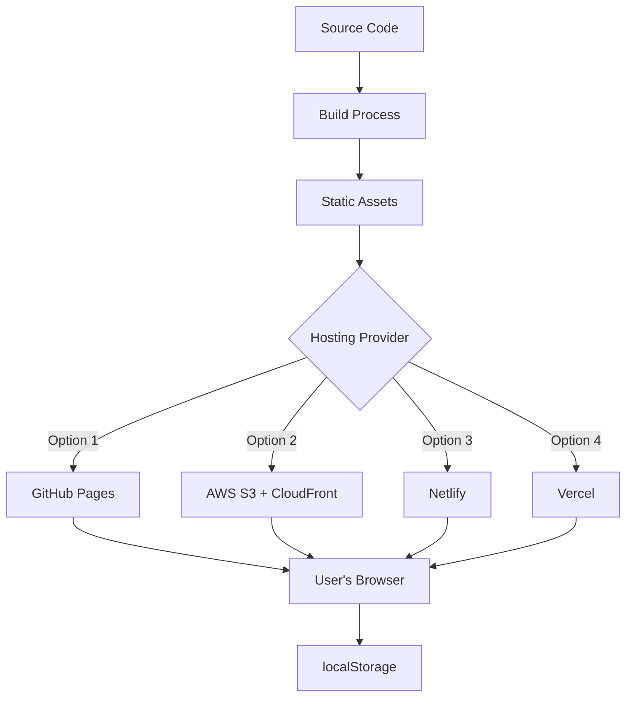
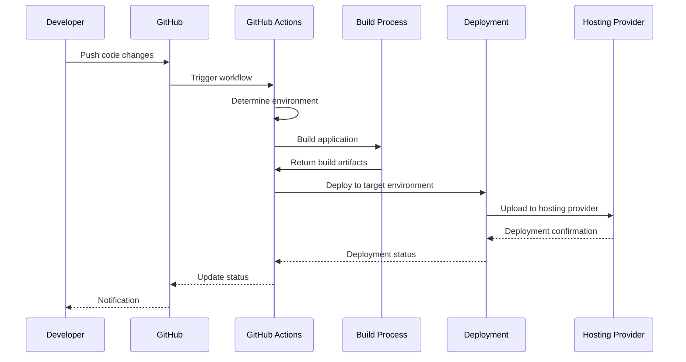

# React Todo List - Deployment Guide

This document provides comprehensive instructions for deploying the React Todo List application to various hosting environments. As a client-side only application that uses browser localStorage for data persistence, the deployment process is straightforward and doesn't require complex server infrastructure.

## 1. DEPLOYMENT OVERVIEW

The React Todo List application follows a simple deployment model appropriate for a static, client-side application. The application is built into a set of static files (HTML, CSS, JavaScript) that can be hosted on any static web hosting service.

### 1.1 Deployment Architecture



The deployment architecture consists of:

1. **Build Process**: Compiles React source code into optimized static assets
2. **Static Assets**: HTML, CSS, JavaScript, and other assets
3. **Hosting Provider**: Various options for hosting the static assets
4. **User's Browser**: Where the application runs and interacts with localStorage

This architecture provides several benefits:
- Simplified deployment and hosting
- Reduced operational costs
- Elimination of server-side security concerns
- Improved scalability through CDN distribution
- Simplified maintenance and updates

### 1.2 Deployment Environments

The application supports three deployment environments:

| Environment | Purpose | Branch | URL Pattern |
|------------|---------|--------|-------------|
| Development | Testing new features | develop | dev.react-todo-list.example.com |
| Staging | Pre-production validation | staging | staging.react-todo-list.example.com |
| Production | End-user access | main | react-todo-list.example.com |

Each environment can have different configurations for:
- Hosting provider
- Domain name
- CDN settings
- Caching policies
- Performance thresholds

Environment-specific configurations are defined in `infrastructure/hosting/config.json`.

### 1.3 Hosting Options

The React Todo List application supports multiple hosting options to accommodate different requirements and preferences:

| Hosting Provider | Description | Best For | Documentation |
|-----------------|-------------|----------|---------------|
| GitHub Pages | Simple static hosting provided by GitHub | Open source projects, simplicity | [GitHub Pages Deployment](#3-1-github-pages-deployment) |
| AWS S3 + CloudFront | Amazon Web Services with CDN | Production deployments, scalability | [AWS Deployment](#3-2-aws-s3-cloudfront-deployment) |
| Netlify | Modern static site hosting platform | Quick deployments, CI/CD integration | [Netlify Deployment](#3-3-netlify-deployment) |
| Vercel | Hosting platform optimized for React | React applications, preview deployments | [Vercel Deployment](#3-4-vercel-deployment) |

The default and recommended hosting option is GitHub Pages due to its simplicity and integration with the project's GitHub repository. For production deployments with higher performance requirements, AWS S3 with CloudFront provides an excellent balance of control, performance, and cost-effectiveness.

## 2. BUILD PROCESS

Before deployment, the React Todo List application must be built into a set of static files that can be hosted on a web server.

### 2.1 Build Requirements

To build the application, you need:

| Requirement | Version | Purpose |
|-------------|---------|--------|
| Node.js | v14.x or higher | JavaScript runtime environment |
| npm | v6.x or higher | Package manager |
| Git | Any recent version | Source code management |

The build process uses Create React App's built-in build system, which includes:
- Webpack for bundling
- Babel for JavaScript transpilation
- PostCSS for CSS processing
- Terser for JavaScript minification
- Optimization plugins for assets

### 2.2 Build Steps

To build the application, follow these steps:

1. Clone the repository (if you haven't already):
   ```bash
   git clone https://github.com/yourusername/react-todo-list.git
   cd react-todo-list
   ```

2. Install dependencies:
   ```bash
   cd src/web
   npm install
   ```

3. Build the application:
   ```bash
   npm run build
   ```

4. The build output will be in the `src/web/build` directory, containing:
   - `index.html`: The main HTML file
   - `static/js/`: JavaScript bundles
   - `static/css/`: CSS files
   - `static/media/`: Images and other assets

The build process optimizes the application for production by:
- Minifying JavaScript and CSS
- Adding content hashes to file names for cache busting
- Optimizing images and other assets
- Creating source maps for debugging
- Applying polyfills for browser compatibility

### 2.3 Environment Variables

The build process can be customized using environment variables. Create React App supports environment-specific configuration through `.env` files:

- `.env`: Default environment variables
- `.env.development`: Development-specific variables
- `.env.production`: Production-specific variables

Common environment variables include:

| Variable | Purpose | Example |
|----------|---------|---------|
| PUBLIC_URL | Base URL path for the application | /react-todo-list |
| REACT_APP_ENVIRONMENT | Current environment | production |
| REACT_APP_API_URL | API URL (for future use) | https://api.example.com |

To use an environment variable in the application, prefix it with `REACT_APP_` and access it via `process.env.REACT_APP_VARIABLE_NAME`.

### 2.4 Build Optimization

The build process includes several optimizations to improve application performance:

| Optimization | Implementation | Benefit |
|-------------|----------------|---------|
| Code Splitting | React.lazy and Suspense | Reduces initial load size |
| Tree Shaking | Webpack (via CRA) | Eliminates unused code |
| Asset Optimization | CRA built-in optimization | Reduces file sizes |
| Minification | Terser | Reduces JavaScript and CSS size |
| Cache Busting | Content hashes in filenames | Ensures users get the latest version |

Additional optimizations can be applied by customizing the build configuration using `craco` or ejecting from Create React App.

## 3. DEPLOYMENT METHODS

The React Todo List application can be deployed using either automated CI/CD pipelines or manual deployment procedures.

### 3.1 GitHub Pages Deployment

GitHub Pages is a free hosting service provided by GitHub that's ideal for static websites like the React Todo List application.

#### Automated Deployment

The application is automatically deployed to GitHub Pages when changes are pushed to the main branch, using the GitHub Actions workflow defined in `.github/workflows/deploy.yml`.

#### Manual Deployment

To manually deploy to GitHub Pages:

1. Build the application:
   ```bash
   cd src/web
   npm run build
   ```

2. Use the deployment script:
   ```bash
   cd ../.. # Return to project root
   ./infrastructure/scripts/deploy.sh -e production -p github-pages
   ```

   Or deploy directly using the gh-pages package:
   ```bash
   cd src/web
   npm install -g gh-pages # If not already installed
   gh-pages -d build
   ```

#### Configuration

For GitHub Pages deployment, update the following:

1. In `package.json`, set the `homepage` field to match your GitHub Pages URL:
   ```json
   "homepage": "https://yourusername.github.io/react-todo-list"
   ```

2. In `infrastructure/hosting/config.json`, configure the GitHub Pages settings:
   ```json
   "github-pages": {
     "branch": "gh-pages",
     "domain": "yourusername.github.io/react-todo-list"
   }
   ```

#### Custom Domain (Optional)

To use a custom domain with GitHub Pages:

1. Add your domain in the GitHub repository settings under "Pages"
2. Create a CNAME file in the `public` directory with your domain
3. Configure your domain's DNS settings as per GitHub's instructions
4. Update the `homepage` in `package.json` to your custom domain

### 3.2 AWS S3/CloudFront Deployment

AWS S3 with CloudFront provides a scalable, high-performance hosting solution for the React Todo List application.

#### Prerequisites

- AWS account
- AWS CLI installed and configured
- Terraform installed (for infrastructure provisioning)

#### Automated Deployment

The application is automatically deployed to AWS when changes are pushed to the main branch, using the GitHub Actions workflow defined in `.github/workflows/deploy.yml`.

#### Manual Deployment

To manually deploy to AWS S3/CloudFront:

1. Build the application:
   ```bash
   cd src/web
   npm run build
   ```

2. Use the deployment script with infrastructure provisioning:
   ```bash
   cd ../.. # Return to project root
   ./infrastructure/scripts/deploy.sh -e production -p aws-s3 -i
   ```

   Or deploy to existing infrastructure:
   ```bash
   ./infrastructure/scripts/deploy.sh -e production -p aws-s3
   ```

#### Infrastructure Setup

The AWS infrastructure is defined using Terraform in the `infrastructure/terraform` directory. To provision the infrastructure manually:

1. Navigate to the Terraform directory:
   ```bash
   cd infrastructure/terraform
   ```

2. Initialize Terraform:
   ```bash
   terraform init
   ```

3. Apply the configuration:
   ```bash
   terraform apply -var="environment=production"
   ```

This will create:
- S3 bucket for hosting
- CloudFront distribution for CDN
- Origin Access Identity for security
- Appropriate bucket policies and permissions

#### CloudFront Configuration

The CloudFront distribution is configured with:

- HTTPS enforcement
- Appropriate cache behaviors for different file types
- Error page handling for SPA routing
- Geo-restrictions (if needed)
- Custom domain and SSL certificate (if configured)

### 3.3 Netlify Deployment

Netlify provides a simple, developer-friendly platform for hosting static websites with built-in CI/CD capabilities.

#### Prerequisites

- Netlify account
- Netlify CLI (optional for manual deployment)

#### Automated Deployment

The application is automatically deployed to Netlify when changes are pushed to the main branch, using the GitHub Actions workflow defined in `.github/workflows/deploy.yml`.

Alternatively, you can connect your GitHub repository directly to Netlify for automatic deployments without using GitHub Actions.

#### Manual Deployment

To manually deploy to Netlify:

1. Build the application:
   ```bash
   cd src/web
   npm run build
   ```

2. Use the deployment script:
   ```bash
   cd ../.. # Return to project root
   ./infrastructure/scripts/deploy.sh -e production -p netlify
   ```

   Or deploy directly using the Netlify CLI:
   ```bash
   cd src/web
   npm install -g netlify-cli # If not already installed
   netlify deploy --prod --dir=build
   ```

#### Configuration

Netlify configuration is defined in `netlify.toml` in the project root:

```toml
[build]
  base = "src/web"
  publish = "build"
  command = "npm run build"

[[redirects]]
  from = "/*"
  to = "/index.html"
  status = 200
```

This configuration handles:
- Build settings
- Publish directory
- Redirects for SPA routing

#### Custom Domain

To use a custom domain with Netlify:

1. Add your domain in the Netlify site settings
2. Configure your domain's DNS settings as per Netlify's instructions
3. Netlify will automatically provision an SSL certificate

### 3.4 Vercel Deployment

Vercel is a cloud platform optimized for frontend frameworks like React, offering seamless deployment and preview environments.

#### Prerequisites

- Vercel account
- Vercel CLI (optional for manual deployment)

#### Automated Deployment

The application is automatically deployed to Vercel when changes are pushed to the main branch, using the GitHub Actions workflow defined in `.github/workflows/deploy.yml`.

Alternatively, you can connect your GitHub repository directly to Vercel for automatic deployments without using GitHub Actions.

#### Manual Deployment

To manually deploy to Vercel:

1. Build the application:
   ```bash
   cd src/web
   npm run build
   ```

2. Use the deployment script:
   ```bash
   cd ../.. # Return to project root
   ./infrastructure/scripts/deploy.sh -e production -p vercel
   ```

   Or deploy directly using the Vercel CLI:
   ```bash
   cd src/web
   npm install -g vercel # If not already installed
   vercel --prod
   ```

#### Configuration

Vercel configuration is defined in `vercel.json` in the project root:

```json
{
  "version": 2,
  "builds": [
    {
      "src": "src/web/package.json",
      "use": "@vercel/static-build",
      "config": { "distDir": "build" }
    }
  ],
  "routes": [
    { "handle": "filesystem" },
    { "src": "/.*", "dest": "/index.html" }
  ]
}
```

This configuration handles:
- Build settings
- Output directory
- Routes for SPA routing

#### Preview Deployments

Vercel automatically creates preview deployments for pull requests, allowing you to test changes before merging to the main branch.

## 4. CI/CD PIPELINE

The React Todo List application uses GitHub Actions for continuous integration and deployment, automating the build, test, and deployment process.

### 4.1 CI/CD Workflow

The CI/CD pipeline is defined in `.github/workflows/deploy.yml` and follows this workflow:



The workflow is triggered by:
- Pushes to main, staging, or develop branches
- Manual workflow dispatch with environment selection

### 4.2 Workflow Configuration

The GitHub Actions workflow consists of several jobs:

1. **Determine Environment**: Identifies the target environment based on the branch or manual input
2. **Build**: Builds the application with environment-specific variables
3. **Deploy**: Deploys the build artifacts to the selected hosting provider
4. **Post-Deployment Checks**: Verifies the deployment was successful

Each job depends on the successful completion of previous jobs, creating a pipeline that ensures the application is properly built and tested before deployment.

### 4.3 Environment Selection

The deployment environment is determined by:

| Trigger | Environment Selection |
|---------|--------------------------|
| Push to main | Production |
| Push to staging | Staging |
| Push to develop | Development |
| Manual workflow | User-selected environment |

The hosting provider is determined by:
1. Manual selection in workflow dispatch
2. Configuration in `infrastructure/hosting/config.json`

This allows for flexible deployment to different environments and hosting providers based on the development workflow and specific requirements.

### 4.4 Secrets Management

The CI/CD pipeline requires several secrets for deployment to different hosting providers:

| Secret | Purpose | Required For |
|--------|---------|----------------|
| GITHUB_TOKEN | GitHub authentication | GitHub Pages deployment |
| AWS_ACCESS_KEY_ID | AWS authentication | AWS S3/CloudFront deployment |
| AWS_SECRET_ACCESS_KEY | AWS authentication | AWS S3/CloudFront deployment |
| NETLIFY_AUTH_TOKEN | Netlify authentication | Netlify deployment |
| NETLIFY_SITE_ID_* | Netlify site identification | Netlify deployment |
| VERCEL_TOKEN | Vercel authentication | Vercel deployment |
| VERCEL_ORG_ID | Vercel organization | Vercel deployment |
| VERCEL_PROJECT_ID | Vercel project | Vercel deployment |

These secrets should be configured in the GitHub repository settings under "Secrets and variables" > "Actions".

## 5. POST-DEPLOYMENT TASKS

After deploying the application, several post-deployment tasks should be performed to ensure proper functionality and performance.

### 5.1 Deployment Verification

After deployment, verify that the application is functioning correctly:

1. **Accessibility Check**: Ensure the application is accessible at the expected URL
2. **Functionality Test**: Verify core features (task creation, completion, filtering)
3. **Console Check**: Check browser console for errors or warnings
4. **Responsive Design**: Test on different devices and screen sizes
5. **Performance Check**: Verify load times and interaction responsiveness

The CI/CD pipeline includes basic verification checks, but manual verification is recommended for critical deployments.

### 5.2 Cache Invalidation

When deploying updates, cache invalidation may be necessary to ensure users receive the latest version:

| Hosting Provider | Cache Invalidation Method |
|-----------------|----------------------------|
| GitHub Pages | Automatic (content hashes in filenames) |
| AWS CloudFront | `aws cloudfront create-invalidation --distribution-id <ID> --paths "/*"` |
| Netlify | Automatic on deployment |
| Vercel | Automatic on deployment |

The deployment script and CI/CD pipeline handle cache invalidation automatically for AWS CloudFront deployments.

### 5.3 Monitoring

After deployment, monitor the application for issues and performance:

1. **Error Monitoring**: Check for JavaScript errors or API failures
2. **Performance Monitoring**: Track load times and interaction responsiveness
3. **User Feedback**: Collect and address user-reported issues

For AWS deployments, CloudWatch can be used to monitor:
- CloudFront distribution metrics
- S3 bucket access patterns
- Error rates and latency

For all deployments, consider implementing client-side monitoring using tools like Google Analytics or a lightweight alternative like Plausible Analytics.

### 5.4 Rollback Procedure

If issues are detected after deployment, a rollback may be necessary:

1. **Identify the Issue**: Determine the nature and severity of the problem
2. **Decide on Rollback**: Assess whether a rollback is necessary or if a forward fix is preferable
3. **Execute Rollback**: Use the appropriate method for your hosting provider

| Hosting Provider | Rollback Method |
|-----------------|----------------|
| GitHub Pages | `git revert` or restore previous commit |
| AWS S3/CloudFront | Use the rollback script: `./infrastructure/scripts/rollback.sh -e production -v <version>` |
| Netlify | Use the Netlify UI to restore a previous deploy |
| Vercel | Use the Vercel UI to restore a previous deploy |

The rollback script (`infrastructure/scripts/rollback.sh`) automates the rollback process for all supported hosting providers.

## 6. TROUBLESHOOTING

This section provides solutions for common deployment issues.

### 6.1 Common Issues

| Issue | Possible Cause | Solution |
|-------|---------------|----------|
| 404 errors after deployment | SPA routing not configured | Ensure proper redirects for client-side routing |
| Blank page after deployment | JavaScript errors, incorrect base URL | Check console for errors, verify PUBLIC_URL setting |
| Stale content after update | Browser or CDN caching | Force cache invalidation, add cache busting parameters |
| Missing assets | Incorrect paths, build configuration | Check asset paths, verify build output |
| CORS errors | Missing CORS headers | Configure appropriate CORS settings in hosting config |
| Deployment failure | Build errors, permission issues | Check build logs, verify credentials and permissions |

### 6.2 Debugging Deployment

When troubleshooting deployment issues:

1. **Check Logs**: Review build and deployment logs for errors
   - GitHub Actions: Check the workflow run logs
   - Manual deployment: Check `infrastructure/scripts/deploy.log`

2. **Verify Build Output**: Inspect the build directory to ensure all files are present
   ```bash
   ls -la src/web/build
   ```

3. **Test Locally**: Serve the build directory locally to verify functionality
   ```bash
   cd src/web/build
   npx serve
   ```

4. **Check Configuration**: Verify environment-specific configuration is correct
   - `.env` files
   - `infrastructure/hosting/config.json`
   - Hosting provider settings

### 6.3 Support Resources

If you encounter issues that cannot be resolved using this guide, consult these resources:

1. **Documentation**:
   - [Create React App Deployment](https://create-react-app.dev/docs/deployment/)
   - [GitHub Pages Documentation](https://docs.github.com/en/pages)
   - [AWS S3 Static Website Hosting](https://docs.aws.amazon.com/AmazonS3/latest/userguide/WebsiteHosting.html)
   - [Netlify Documentation](https://docs.netlify.com/)
   - [Vercel Documentation](https://vercel.com/docs)

2. **Community Support**:
   - GitHub Issues for this project
   - Stack Overflow for technical questions
   - React community forums

3. **Contact**:
   - Project maintainers via GitHub
   - Support channels for specific hosting providers

## 7. SECURITY CONSIDERATIONS

While the React Todo List is a client-side application with minimal security requirements, several security best practices should be followed during deployment.

### 7.1 HTTPS Enforcement

Always enforce HTTPS for all environments to protect data in transit:

| Hosting Provider | HTTPS Configuration |
|-----------------|---------------------|
| GitHub Pages | Enabled by default |
| AWS CloudFront | Configure in distribution settings |
| Netlify | Enabled by default |
| Vercel | Enabled by default |

HTTPS enforcement is configured in `infrastructure/hosting/config.json` for AWS deployments:

```json
"security": {
  "forceHttps": true
}
```

### 7.2 Content Security Policy

Implement a Content Security Policy (CSP) to prevent XSS attacks and other security issues:

```html
<meta http-equiv="Content-Security-Policy" content="default-src 'self'; script-src 'self' 'unsafe-inline'; style-src 'self' 'unsafe-inline'; img-src 'self' data:; font-src 'self'; connect-src 'self';">
```

This CSP is included in the `public/index.html` file and restricts resource loading to the same origin, with limited exceptions for inline scripts and styles.

For AWS CloudFront and other providers, CSP can also be implemented using response headers configured in `infrastructure/hosting/config.json`:

```json
"security": {
  "headers": {
    "Content-Security-Policy": "default-src 'self'; script-src 'self' 'unsafe-inline'; style-src 'self' 'unsafe-inline'; img-src 'self' data:; font-src 'self'; connect-src 'self';"
  }
}
```

### 7.3 Secrets Management

Protect deployment credentials and other secrets:

1. **Never commit secrets to the repository**
2. **Use GitHub Secrets for CI/CD credentials**
3. **Use environment variables for non-sensitive configuration**
4. **Limit access to deployment credentials**

For manual deployments, consider using environment variables or a secure secrets management solution rather than hardcoding credentials in scripts or configuration files.

### 7.4 Access Controls

Implement appropriate access controls for hosting resources:

| Hosting Provider | Access Control Measures |
|-----------------|-------------------------|
| GitHub Pages | Repository permissions |
| AWS S3/CloudFront | IAM policies, Origin Access Identity |
| Netlify | Team permissions, deploy contexts |
| Vercel | Team permissions, preview protection |

For AWS deployments, the S3 bucket is configured to deny public access, with CloudFront accessing it through an Origin Access Identity. This configuration is managed by Terraform in `infrastructure/terraform/main.tf`.

## 8. PERFORMANCE OPTIMIZATION

Optimize the deployed application for performance to provide the best user experience.

### 8.1 Caching Strategy

Implement an effective caching strategy to improve load times and reduce bandwidth usage:

| File Type | Cache Duration | Cache Control Header |
|-----------|---------------|----------------------|
| HTML | No cache | `no-cache, no-store, must-revalidate` |
| JavaScript/CSS | 1 year | `public, max-age=31536000, immutable` |
| Images | 1 day | `public, max-age=86400` |
| Fonts | 1 year | `public, max-age=31536000, immutable` |

This caching strategy is configured in `infrastructure/hosting/config.json` and applied during deployment:

```json
"caching": {
  "profiles": {
    "html": {
      "maxAge": 0,
      "cacheControl": "no-cache, no-store, must-revalidate"
    },
    "js": {
      "maxAge": 31536000,
      "cacheControl": "public, max-age=31536000, immutable"
    }
    // Additional profiles...
  }
}
```

### 8.2 CDN Configuration

Configure Content Delivery Network (CDN) settings to improve global performance:

| CDN Feature | Configuration | Benefit |
|------------|---------------|---------|
| Edge Locations | Appropriate for target audience | Reduced latency |
| Compression | Enable Gzip/Brotli | Reduced transfer size |
| HTTP/2 | Enable | Improved connection efficiency |
| Origin Shield | Consider for high-traffic sites | Reduced origin load |

For AWS CloudFront, these settings are configured in `infrastructure/cloudfront/distribution.json` and applied by Terraform during deployment.

### 8.3 Lazy Loading

Implement lazy loading for non-critical resources to improve initial load time:

1. **Code Splitting**: The application uses React.lazy and Suspense to split code into smaller chunks
2. **Image Lazy Loading**: Images use the `loading="lazy"` attribute
3. **Route-Based Splitting**: Components are loaded based on the current route

These optimizations are implemented in the application code and preserved during the build process.

### 8.4 Performance Monitoring

Monitor application performance after deployment to identify and address issues:

1. **Lighthouse**: Run Lighthouse audits to measure performance, accessibility, and best practices
2. **Web Vitals**: Track Core Web Vitals metrics (LCP, FID, CLS)
3. **Real User Monitoring**: Consider implementing RUM for production environments

For AWS deployments, CloudWatch can be used to monitor CloudFront performance metrics. For all deployments, consider implementing client-side performance monitoring using the Web Vitals library.

## 9. CONTINUOUS IMPROVEMENT

Establish processes for continuously improving the deployment process and application performance.

### 9.1 Deployment Metrics

Track key metrics related to the deployment process:

| Metric | Target | Measurement Method |
|--------|--------|-------------------|
| Deployment Frequency | As needed | Count of successful deployments |
| Deployment Time | < 5 minutes | CI/CD workflow duration |
| Deployment Success Rate | > 95% | Successful / total deployments |
| Rollback Frequency | < 5% | Rollbacks / total deployments |

Regularly review these metrics to identify areas for improvement in the deployment process.

### 9.2 Feedback Loop

Establish a feedback loop to continuously improve the deployment process:

1. **Collect Feedback**: Gather input from developers and users
2. **Analyze Issues**: Review deployment failures and performance problems
3. **Implement Improvements**: Update deployment scripts and configurations
4. **Measure Impact**: Track metrics before and after changes

Document lessons learned and best practices in a shared knowledge base to improve future deployments.

### 9.3 Update Procedures

Regularly update the deployment infrastructure and dependencies:

| Component | Update Frequency | Responsibility |
|-----------|-----------------|-----------------|
| Node.js/npm | Quarterly | Development Team |
| GitHub Actions | As needed | DevOps Team |
| AWS Resources | As needed | Infrastructure Team |
| Security Patches | Immediately | Security Team |

Establish a process for testing updates in a development environment before applying them to production.

## 10. FUTURE ENHANCEMENTS

Consider these potential enhancements to the deployment process as the application evolves.

### 10.1 Multi-Environment Strategy

Expand the environment strategy to support additional use cases:

| Environment | Purpose | Implementation |
|------------|---------|-----------------|
| Feature Environments | Testing individual features | Deploy from feature branches |
| QA Environment | Dedicated testing environment | Separate from development |
| Demo Environment | Client demonstrations | Stable, controlled environment |

Implement environment-specific configurations and access controls to support these additional environments.

### 10.2 Progressive Web App

Enhance the application to function as a Progressive Web App (PWA):

1. **Service Worker**: Implement offline support and caching
2. **Web App Manifest**: Enable "Add to Home Screen" functionality
3. **Push Notifications**: Add support for notifications (future backend integration)

These enhancements would require additional deployment considerations, such as service worker caching strategies and manifest configuration.

### 10.3 Backend Integration

If the application evolves to include backend services:

1. **API Deployment**: Implement deployment process for backend API
2. **Database Migrations**: Add support for database schema changes
3. **Environment Variables**: Expand environment configuration for API endpoints
4. **Authentication**: Implement secure authentication flow

These enhancements would significantly change the deployment architecture, requiring additional infrastructure and security considerations.

### 10.4 Containerization

Consider containerizing the application for more consistent deployments:

1. **Docker**: Create Docker images for the application
2. **Kubernetes**: Deploy to Kubernetes for advanced orchestration
3. **CI/CD Integration**: Update pipelines to build and deploy containers

Containerization would provide more consistency across environments and simplify scaling if backend services are added.

This deployment guide provides comprehensive instructions for building, deploying, and maintaining the React Todo List application across various hosting environments. By following these guidelines, you can ensure reliable, secure, and performant deployments that deliver a great user experience. As the application evolves, the deployment process can be enhanced to support additional requirements and use cases.