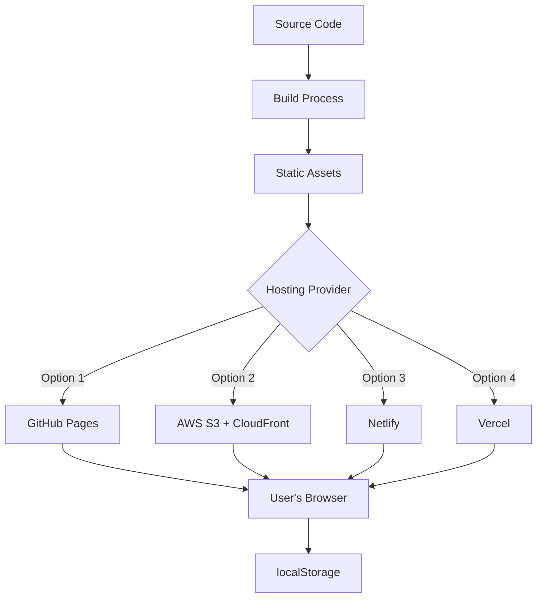
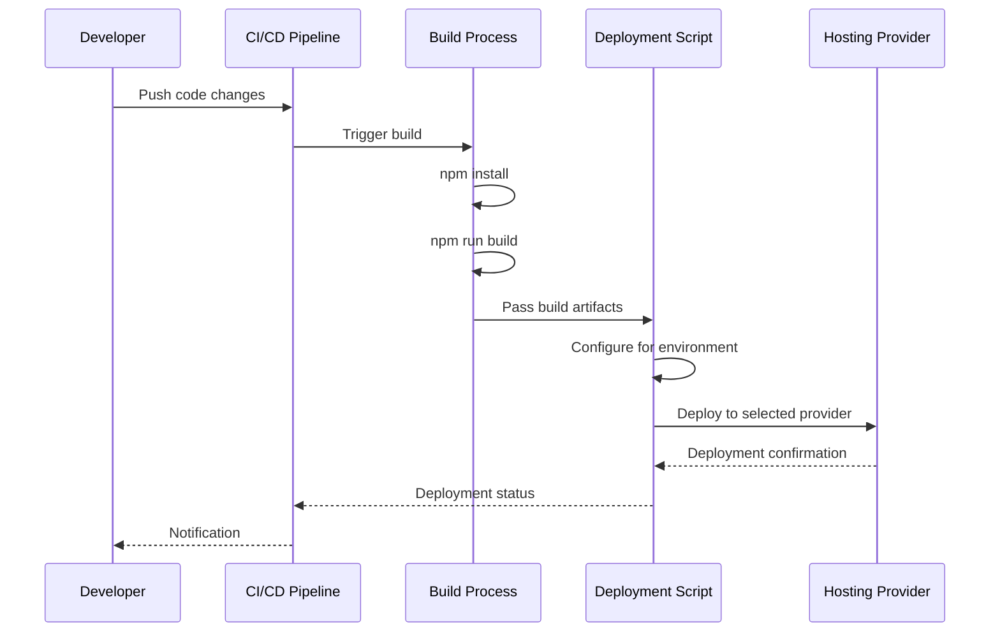
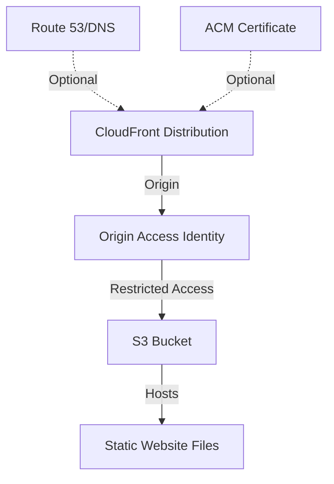
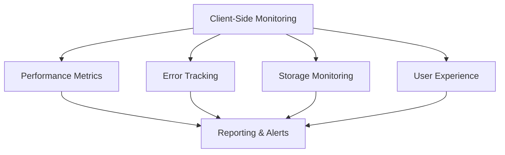
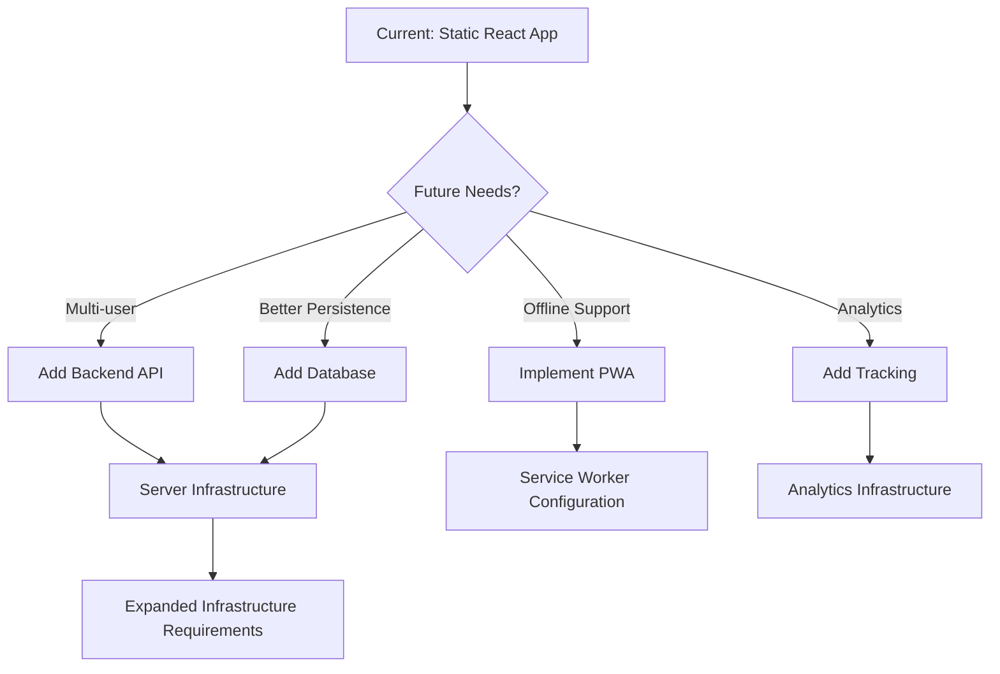

# React Todo List - Infrastructure Documentation

This directory contains the infrastructure configuration and documentation for the React Todo List application. As a client-side only application, the infrastructure is focused on static web hosting, build and deployment processes, and basic monitoring capabilities without server-side components.

## Infrastructure Overview

The React Todo List application follows a simple, client-side only architecture that eliminates the need for complex server infrastructure. The application runs entirely in the user's browser and uses localStorage for data persistence.



This infrastructure approach provides several benefits:
- Simplified deployment and hosting
- Reduced operational costs
- Elimination of server-side security concerns
- Improved scalability through CDN distribution
- Simplified maintenance and updates

## Directory Structure

The infrastructure directory is organized as follows:

```
infrastructure/
├── README.md                 # This file
├── hosting/                  # Hosting configuration
│   ├── README.md             # Hosting documentation
│   └── config.json           # Hosting configuration settings
├── terraform/                # Terraform IaC for AWS resources
│   ├── README.md             # Terraform documentation
│   ├── main.tf               # Main Terraform configuration
│   ├── variables.tf          # Terraform variables
│   └── outputs.tf            # Terraform outputs
├── scripts/                  # Deployment and maintenance scripts
│   ├── deploy.sh             # Main deployment script
│   ├── backup.sh             # Backup script
│   └── rollback.sh           # Rollback script
├── cloudfront/               # CloudFront configuration (for AWS)
│   └── distribution.json     # CloudFront distribution settings
├── s3/                       # S3 configuration (for AWS)
│   ├── bucket-policy.json    # S3 bucket policy
│   └── cors-configuration.json # CORS settings
└── monitoring/               # Monitoring configuration
    ├── README.md             # Monitoring documentation
    ├── performance-rules.json # Performance thresholds
    └── alerts.json           # Alert configurations
```

Each subdirectory contains specific configuration and documentation for different aspects of the infrastructure.

## Hosting Options

The React Todo List application supports multiple hosting options to accommodate different requirements and preferences:

| Hosting Provider | Description | Best For | Documentation |
|-----------------|-------------|----------|---------------|
| GitHub Pages | Simple static hosting provided by GitHub | Open source projects, simplicity | [Hosting Documentation](./hosting/README.md#github-pages-deployment) |
| AWS S3 + CloudFront | Amazon Web Services with CDN | Production deployments, scalability | [Terraform Documentation](./terraform/README.md) |
| Netlify | Modern static site hosting platform | Quick deployments, CI/CD integration | [Hosting Documentation](./hosting/README.md#netlify-deployment) |
| Vercel | Hosting platform optimized for React | React applications, preview deployments | [Hosting Documentation](./hosting/README.md#vercel-deployment) |

The default and recommended hosting option is GitHub Pages due to its simplicity and integration with the project's GitHub repository. For production deployments with higher performance requirements, AWS S3 with CloudFront provides an excellent balance of control, performance, and cost-effectiveness.

For detailed hosting configuration and deployment instructions, refer to the [Hosting Documentation](./hosting/README.md).

## Deployment Process

The application uses a streamlined deployment process that builds the React application and deploys it to the selected hosting provider:



The deployment process is handled by the `deploy.sh` script in the `scripts` directory. This script supports different environments (development, staging, production) and hosting providers.

### Deployment Command

```bash
./infrastructure/scripts/deploy.sh -e <environment> -p <provider>
```

Where:
- `<environment>` is one of: development, staging, production
- `<provider>` is one of: github-pages, aws-s3, netlify, vercel

For detailed deployment options and parameters, refer to the script's help:

```bash
./infrastructure/scripts/deploy.sh --help
```

For AWS deployments, the script integrates with Terraform to provision or update the required infrastructure before deploying the application.

## AWS Infrastructure

For AWS deployments, the application uses Terraform to provision and manage the required infrastructure:

- **S3 Bucket**: Hosts the static website files
- **CloudFront Distribution**: Provides CDN capabilities and HTTPS
- **Origin Access Identity**: Secures access to the S3 bucket
- **Bucket Policy**: Controls access permissions
- **Optional ACM Certificate**: For custom domains



The AWS infrastructure is defined in the Terraform configuration files in the `terraform` directory. For detailed information on the AWS infrastructure, refer to the [Terraform Documentation](./terraform/README.md).

## Monitoring and Observability

The React Todo List application implements a lightweight monitoring approach appropriate for a client-side application:

- **Performance Monitoring**: Tracks rendering, interaction, and storage performance
- **Error Tracking**: Captures and reports runtime errors
- **Storage Monitoring**: Tracks localStorage usage and quota limits
- **User Experience Monitoring**: Optional tracking of feature usage



The monitoring configuration is defined in the files in the `monitoring` directory. For detailed information on the monitoring approach, refer to the [Monitoring Documentation](./monitoring/README.md).

## Environment Management

The application supports three deployment environments:

1. **Development**: For development and testing purposes
2. **Staging**: For pre-production validation
3. **Production**: For live deployment

Each environment can have different settings for:
- Hosting provider
- Domain name
- CDN configuration
- Caching policies
- Performance thresholds

Environment-specific configurations are defined in the `config.json` file in the `hosting` directory. The environment is specified when running the deployment script:

```bash
./infrastructure/scripts/deploy.sh -e production
```

This approach allows for consistent deployment across different environments while accommodating environment-specific requirements.

## Cost Considerations

The infrastructure is designed to be cost-effective for a simple static website:

| Hosting Option | Estimated Cost | Notes |
|----------------|----------------|-------|
| GitHub Pages | Free | For public repositories |
| AWS S3 + CloudFront | $0.50 - $5/month | Depends on traffic |
| Netlify | Free tier | Sufficient for most use cases |
| Vercel | Free tier | Sufficient for most use cases |

For AWS deployments, costs are broken down as follows:

- **S3 Storage**: < $0.10 for typical usage
- **CloudFront**: $0.10 - $1.00 depending on traffic
- **Data Transfer**: Varies based on traffic
- **ACM Certificate**: Free with CloudFront
- **Logs Storage**: $0.10 - $0.50 if enabled

To minimize costs:
- Use GitHub Pages for development and small projects
- Disable logging in development environments
- Use appropriate CloudFront price class
- Set optimal cache TTL values
- Clean up resources when no longer needed

## Security Considerations

Although the React Todo List is a client-side only application with no sensitive data handling requirements, several security best practices are implemented:

- **HTTPS Enforcement**: All environments force HTTPS connections
- **Content Security Policy**: Appropriate security headers
- **Private S3 Bucket**: When using AWS, the S3 bucket is not publicly accessible
- **CloudFront OAI**: Only CloudFront can access the S3 bucket
- **Modern TLS**: TLS 1.2+ is enforced
- **No Sensitive Data**: Application design avoids collecting sensitive information

These measures provide appropriate security for a client-side application while maintaining simplicity.

## Maintenance Procedures

Regular maintenance tasks include:

1. **Dependency Updates**: Keep dependencies updated for security and features
2. **Performance Monitoring**: Review performance metrics regularly
3. **Cost Review**: Monitor resource usage and costs (for AWS)
4. **Security Patches**: Apply security updates as needed

### Backup Procedure

The `backup.sh` script in the `scripts` directory can be used to create backups of the deployment:

```bash
./infrastructure/scripts/backup.sh -e production
```

### Rollback Procedure

If a deployment causes issues, the `rollback.sh` script can be used to revert to a previous version:

```bash
./infrastructure/scripts/rollback.sh -e production -v <version>
```

Where `<version>` is the backup version to restore.

## Troubleshooting

Common issues and their solutions:

| Issue | Possible Cause | Solution |
|-------|---------------|----------|
| 404 errors after deployment | SPA routing not configured | Ensure proper redirects for client-side routing |
| Stale content after update | Browser or CDN caching | Add cache busting with file hashes, force CDN invalidation |
| CORS errors | Missing CORS headers | Configure appropriate CORS settings in hosting config |
| Slow initial load | Large bundle size | Implement code splitting, optimize assets |
| Deployment failures | Build errors, permission issues | Check build logs, verify credentials and permissions |

For detailed error information, check the deployment logs in `scripts/deploy.log`.

## Future Enhancements

While the current infrastructure is simple and client-side only, future scaling considerations might include:

| Enhancement | Implementation Approach | When to Consider |
|-------------|--------------------------|------------------|
| Multi-user Support | Backend API + Database | When user collaboration is needed |
| Data Synchronization | Backend storage + API | When multi-device sync is required |
| Offline Support | PWA with Service Workers | To enhance user experience |
| Analytics | Server-side analytics | When detailed usage data is needed |



These enhancements would require additional infrastructure components and should be considered based on evolving project requirements.